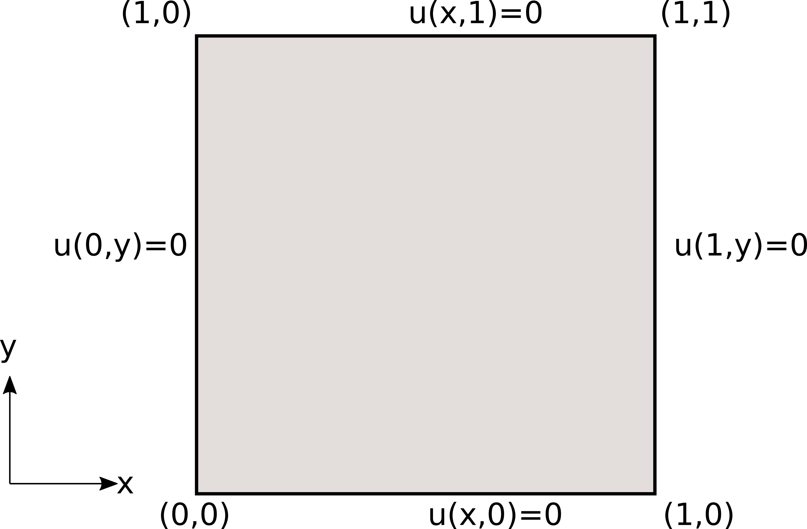
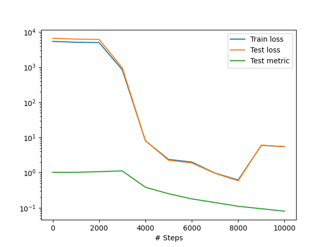
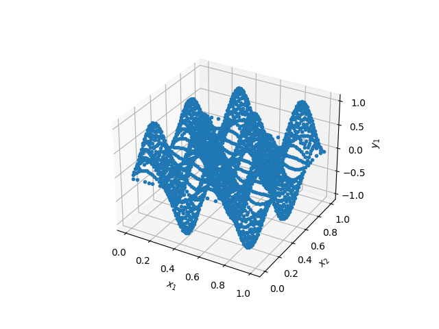

.. _akustika_ravan:

Решавање на домену облика квадрата
==========================================
 
Кренућемо од најједноставнијег дводимензионог случаја стојећег таласа у акустици. За таласни број :math:`k_0=2 \pi n` за :math:`n=2`, треба решити Хелмхолцову (*Helmholtz*) једначину облика:

.. math:: 
    -\frac{\partial^2 u}{\partial x^2} - \frac{\partial^2 u}{\partial y^2} - k_0^2 u = f, \quad \mid \Omega=[0,1]^2

уз Дирихлеове граничне услове 

.. math:: 
    u(x,y)=0, \quad (x,y) \in \partial \Omega

приказане на :numref:`akustika-2d` и члан који специфицира извор :math:`f(x,y)=k_0^2 \sin(k_0x) \sin(k_0 y)`.

.. _akustika-2d:

    Поставка проблема и граничних услова.

Постоји егзактно решење овог проблема и оно гласи:

.. math:: 
    u(x,y) = \sin(k_0 x) \sin(k_0 y).

За више детаља у погледу теоријске позадине диференцијалне једначине и граничних услова читалац може погледати :cite:t:`ihlenburg1998finite`. Решење методом коначних елемената (МКЕ) је такође доступно у оквиру `Dolfinx туторијала <https://github.com/FEniCS/dolfinx/blob/main/python/demo/demo_helmholtz.py>`_. 

Имплементација
----------------

Решење директног проблема приказано је на следећем листингу. 

.. code-block:: python
    :caption: Решење проблема простирања стојећег таласа у 2Д коришћењем DeepXDE библиотеке
    :linenos:

    import deepxde as dde
    import numpy as np

    # Frekvencija
    n = 2

    precision_train = 10
    precision_test = 30
    weights = 100
    iterations = 10000
    learning_rate, num_dense_layers, num_dense_nodes, activation = 1e-3, 3, 150, "sin"

    # Uvezi sinus
    from deepxde.backend import tf
    sin = tf.sin

    # Osnovna PDE
    def pde(x, u):
        du_xx = dde.grad.hessian(u, x, i=0, j=0)
        du_yy = dde.grad.hessian(u, x, i=1, j=1)

        f = k0 ** 2 * sin(k0 * x[:, 0:1]) * sin(k0 * x[:, 1:2])
        return -du_xx - du_yy - k0 ** 2 * u - f

    # Egzaktno resenje
    def func(x):
        return np.sin(k0 * x[:, 0:1]) * np.sin(k0 * x[:, 1:2])

    # Da li je kol. tacka na granici?
    def boundary(_, on_boundary):
        return on_boundary

    # Geometrija jedinicnog kvadrata
    geom = dde.geometry.Rectangle([0, 0], [1, 1])
    # Talasni broj
    k0 = 2 * np.pi * n
    # Talasna duzina
    wave_len = 1 / n

    hx_train = wave_len / precision_train
    nx_train = int(1 / hx_train)

    hx_test = wave_len / precision_test
    nx_test = int(1 / hx_test)

    # Dirihleov granicni uslov y=0 na granicama
    bc = dde.icbc.DirichletBC(geom, lambda x: 0, boundary)

    data = dde.data.PDE(
        geom,
        pde,
        bc,
        num_domain=nx_train ** 2,
        num_boundary=4 * nx_train,
        solution=func,
        num_test=nx_test ** 2,
    )

    # Mreza i model
    net = dde.nn.FNN([2] + [num_dense_nodes] * num_dense_layers + [1], activation, "Glorot uniform")
    model = dde.Model(data, net)

    # Forsiraj vece tezine za granicne uslove nego za unutrasnjost domena
    loss_weights = [1, weights]

    model.compile("adam", lr=learning_rate, metrics=["l2 relative error"], loss_weights=loss_weights)

    losshistory, train_state = model.train(iterations=iterations)
    dde.saveplot(losshistory, train_state, issave=True, isplot=True)

Након стандардног импорта одговарајућих модула, почињемо спецификацијом општих параметара. Овај пример има пар специфичности у односу на остале. Наиме, да би се успешно моделовале таласне појаве помоћу ФЗНН, густина колокационих тачака мора да буде директно пропорционална фреквенцији. Што је виша фреквенција ``n``, мања је таласна дужина ``wave_len``, па је потребно више колокационих тачака да покрије домен. Овде смо узели 10 кол. тачака по таласној дужини током тренинга и 30 тачака по таласној дужини у тест скупу. 

.. code-block:: python

    # Frekvencija talasa
    n = 2
    precision_train = 10
    precision_test = 30
    weights = 100
    learning_rate, num_dense_layers, num_dense_nodes, activation = 1e-3, 3, 150, "sin"

Такође, видимо да користимо архитектуру са мањим бројем слојева, али са више неурона по слоју, као и активациону функцију :math:`\sin(x)` која би требало да буде погоднија за опонашање таласних феномена. 

Следи спецификација саме парцијалне диференцијалне једначине у облику функције губитка како смо већ навикли:

.. code-block:: python

    def pde(x, u):
        du_xx = dde.grad.hessian(u, x, i=0, j=0)
        du_yy = dde.grad.hessian(u, x, i=1, j=1)

        f = k0 ** 2 * sin(k0 * x[:, 0:1]) * sin(k0 * x[:, 1:2])
        return -du_xx - du_yy - k0 ** 2 * u - f

Овде користимо услужну функцију ``dde.grad.hessian`` одабиром координате која се диференцира и којом се диференцира. У овом примеру су гранични услови елементарни, па их овде нећемо посебно наводити. 

Геометрија, таласни број :math:`k_0=2 \pi \nu` и таласна дужина :math:`\lambda=\frac{1}{\nu}` дају се као:

.. code-block:: python

    geom = dde.geometry.Rectangle([0, 0], [1, 1])
    k0 = 2 * np.pi * n
    wave_len = 1 / n

Једина специфичност коју додатно треба нагласити је да понекад треба форсирати поштовање граничних услова тиме што ћемо члану функције губитка који се односи на Дирихлеов гранични услов добити већу тежину у односу на члан који се односи на диференцијалну једначину. 

.. code-block:: python

    weights = 100
    loss_weights = [1, weights]
    model.compile("adam", lr=learning_rate, metrics=["l2 relative error"], loss_weights=loss_weights)

Да би се избегао овај корак који са собом носи експериментисање са различитим вредностима тежинског фактора, гранични услов се код *DeepXDE* може задавати и дирекнтом трансоформацијом функције губитка, али овде се тиме нећемо бавити.

Резултати
----------------

Након 10000 епоха обучавања оптимизационом меотодом ``Adam`` који је протекао као што је приказано на :numref:`rezultati1-loss`, добијамо стојећи талас чији 3Д приказ можемо видети на :numref:`rezultati1`.

.. _rezultati1-loss:

    Ток обучавања ФЗНН

.. _rezultati1:

    Тродимензиони приказ таласа у домену облика квадрата

Мера грешке модела RMSE (*Root Mean Squared Error*) и износи :math:`7,98 \cdot 10^{-2}`. Уз обраћање посебне пажње на форсирање граничних услова, затим архитектуру ФЗНН и најзад тип активационе функције, успели смо да добијемо прилично добро решење. Читалац може самостално да проба како би промена фреквенције (а самим тим и таласне дужине), густине колокационих тачака, архитектуре, утицала на процес обучавања модела. 

Овде можемо дати и кратку препоруку **како приступити моделовању сложенијих појава**, са сложенијом геометријом и комплекснијим граничним условима. Пошто ФЗНН решавање зависи од већег броја хипер-параметара, препорука је да се прво реши до краја поједностављен проблем базиран на истој диференцијалној једначини, али са једноставнијом геометријом и граничним условима. Када се стекне "осећај" која комбинација хипер-параметара води до решења, онда је лакше приступити главном (комплексном) проблему.  С друге стране, постоји неколико алата који претрагу хипер-параметара чине ефикаснијом, као већ поменути `BlackFox <https://blackfox.ai>`_ који користи дистрибуирани генетски алгоритам.
