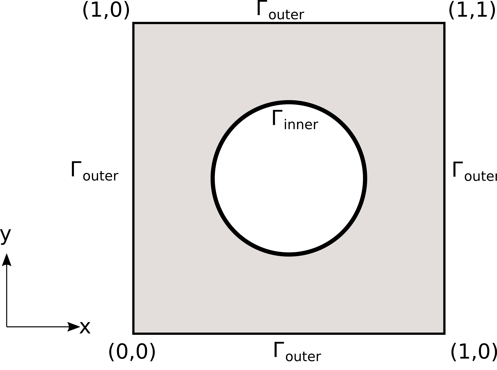

.. _akustika_rupa:

Решавање на домену облика квадрата са шупљином
================================================
 
У односу на претходни пример :ref:`akustika_ravan` додајемо шупљину у средини квадратног домена и прописујемо одговарајуће Нојманове граничне услове на ободу шупљине. Да се подсетимо, домен проблема :math:`\Omega` је квадрат странице :math:`L, \, L=1`, из кога искључујемо круг полупречника :math:`R=\frac{1}{4}`. За таласни број :math:`k_0=2 \pi n` и :math:`n=1`, решавамо Хелмхолцову једначину:

.. math::
    -\frac{\partial^2 u}{\partial x^2} - \frac{\partial^2 u}{\partial y^2} - k_0^2 u = f, \quad \text{ u } \Omega,

где је члан који специфицира извор :math:`f(x,y)=k_0^2 \sin(k_0x) \sin(k_0 y)`. Облик домена може се видети на :numref:`akustika-rupa`.

.. _akustika-rupa:

    Поставка проблема и гранични услови

Постоји аналитичко решење овог проблема и оно гласи:

.. math:: 
    u(x,y) = \sin(k_0 x) \sin(k_0 y).

Овде ћемо специфицирати Дирихлеове граничне услове према аналитичком решењу на спољној граници домена :math:`\Omega` коју означавамо са :math:`\Gamma_{outer}`:

.. math:: 
    u(x,y) \left| \right. \Gamma_{outer} = \sin(k_0 x) \sin(k_0 y), \quad (x,y) \in \Gamma_{outer}

На сличан начин, можемо да дефинишемо гранични услов на унутрашњој граници, овог пута Нојманов:

.. math::
    :label: eq:njuman

    (\nabla u \left| \right. \Gamma_{inner} \cdot n) (x,y) = \left[ k_0 \cos(k_0 x) \sin(k_0 y), k_0 \sin(k_0 x) \cos(k_0 y) \right] \cdot n = g(x,y),

где је :math:`n` вектор нормале. Концизније написано, Нојманов гранични услов на унутрашњој граници гласи:

.. math::
    \nabla u \left| \right. \Gamma_{inner} \cdot n = g.

Имплементација
----------------

На следећем листингу су дати главни детаљи имплементације. Намерно су изостављени делови који су ирелевантни за само решавање, као што је цртање дијаграма. Целокупна скрипта се, као и остале, налази у репозиторијуму са примерима. 

.. code-block:: python
    :caption: Решење проблема простирања стојећег таласа у 2Д домену са шупљином
    :linenos:

    import deepxde as dde
    import matplotlib.pyplot as plt
    import numpy as np
    from deepxde.backend import tf
    sin = tf.sin

    # Opsti parametri
    n = 2
    length = 1
    R = 1 / 4

    precision_train = 15
    precision_test = 30

    weight_inner = 10
    weight_outer = 100
    iterations = 5000
    learning_rate = 1e-3
    num_dense_layers = 3
    num_dense_nodes = 350
    activation = "sin"

    k0 = 2 * np.pi * n
    wave_len = 1 / n

    # Parcijalna diferencijalna jednacina
    def pde(x, y):
        dy_xx = dde.grad.hessian(y, x, i=0, j=0)
        dy_yy = dde.grad.hessian(y, x, i=1, j=1)
        f = k0**2 * sin(k0 * x[:, 0:1]) * sin(k0 * x[:, 1:2])
        return -dy_xx - dy_yy - k0**2 * y - f

    # Egzaktno resenje
    def func(x):
        return np.sin(k0 * x[:, 0:1]) * np.sin(k0 * x[:, 1:2])

    # Da li je tacka na granici?
    def boundary(_, on_boundary):
        return on_boundary

    # Njumanovi granicni uslovi prema egzaktnom resenju
    def neumann(x):
        grad = np.array([
                k0 * np.cos(k0 * x[:, 0:1]) * np.sin(k0 * x[:, 1:2]),
                k0 * np.sin(k0 * x[:, 0:1]) * np.cos(k0 * x[:, 1:2]),])

        normal = -inner.boundary_normal(x)
        normal = np.array([normal]).T
        result = np.sum(grad * normal, axis=0)
        return result

    # Geometrija
    outer = dde.geometry.Rectangle([-length / 2, -length / 2], [length / 2, length / 2])
    inner = dde.geometry.Disk([0, 0], R)

    # Da li je tacka na spoljnoj granici?
    def boundary_outer(x, on_boundary):
        return on_boundary and outer.on_boundary(x)

    # Da li je tacka na unutrasnjoj granici?
    def boundary_inner(x, on_boundary):
        return on_boundary and inner.on_boundary(x)

    # Iskljuci krug iz kvadrata
    geom = outer - inner

    hx_train = wave_len / precision_train
    nx_train = int(1 / hx_train)

    hx_test = wave_len / precision_test
    nx_test = int(1 / hx_test)

    # Na unutrasnjoj granici Njuman, na spoljnoj Dirihleovi
    bc_inner = dde.icbc.NeumannBC(geom, neumann, boundary_inner)
    bc_outer = dde.icbc.DirichletBC(geom, func, boundary_outer)

    data = dde.data.PDE(
        geom,
        pde,
        [bc_inner, bc_outer],
        num_domain=nx_train**2,
        num_boundary=16 * nx_train,
        solution=func,
        num_test=nx_test**2,
    )

    net = dde.nn.FNN(
        [2] + [num_dense_nodes] * num_dense_layers + [1], activation, "Glorot uniform"
    )

    model = dde.Model(data, net)

    loss_weights = [1, weight_inner, weight_outer]
    model.compile("adam", lr=learning_rate, metrics=["l2 relative error"], loss_weights=loss_weights)

    losshistory, train_state = model.train(iterations=iterations)

Користићемо *Tensorflow* као *backend* у свим нашим примерима, али треба имати у виду да оквир *DeepXDE* подржава и *PyTorch* и још неке. Након стандардне спецификације општих параметара и хипер-параметара, као у примеру :ref:`akustika_ravan`, уз једину модификацију додавања нешто више неурона по слоју (350), дефинишемо Нојманов гранични услов према једначини :math:numref:`eq:njuman`:

.. code-block:: python

    def neumann(x):
        grad = np.array([
                k0 * np.cos(k0 * x[:, 0:1]) * np.sin(k0 * x[:, 1:2]),
                k0 * np.sin(k0 * x[:, 0:1]) * np.cos(k0 * x[:, 1:2]),])

        normal = -inner.boundary_normal(x)
        normal = np.array([normal]).T
        result = np.sum(grad * normal, axis=0)
        return result
    
Као што се види из кода, постоје услужне функције које рачунају нормале на правилне границе у колокационим тачкама. Пондерске тежине граничних услова у обуци ``weight_inner`` и ``weight_outer`` такође спадају у неку врсту хипер-параметара, па и њима треба посветити пажњу уз неколико мануелних проба. Даље, следи спецификација геометрије проблема као разлике квадрата и диска:

.. code-block:: python

    outer = dde.geometry.Rectangle([-length / 2, -length / 2], [length / 2, length / 2])
    inner = dde.geometry.Disk([0, 0], R)
    geom = outer - inner

Остатак скрипте је сличан примеру без шупљине :ref:`akustika_ravan`, па га нећемо додатно појашњавати. Довољно је рећи да пажњу треба обратити да буде довољно колокационих тачака на спољној и на унутрашњој граници. 

Резултати
------------

Добијени резултати су приказани у форми контурног графика на :numref:`rezultati-rupa`. Око унутрашње границе приказани су правци вектора нормала. 

.. _rezultati-rupa:

.. figure:: rezultati-rupa.png
    :width: 90%

    Резултати примера квадратног домена са шупљином

Мера релативне грешке модела износи 0,048. Уз обраћање посебне пажње на форсирање граничних услова, затим архитектуру НМПФЗ и најзад тип активационе функције, успели смо да добијемо прилично добро решење. Читалац може самостално да проба како би промена фреквенције (а самим тим и таласне дужине), густине колокационих тачака, архитектуре, утицала на процес обуке модела.
