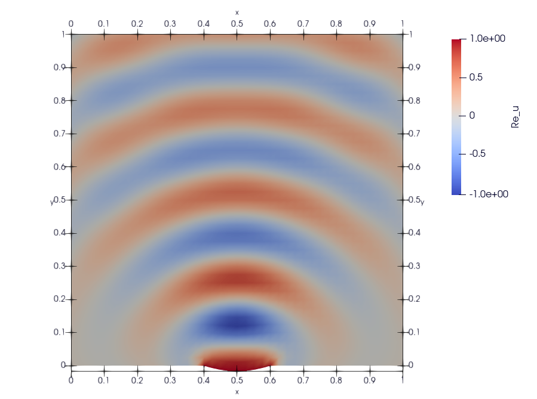

.. _akustika_socivo:

Дводимензиони проблем са сочивом
======================================

Овај одељак се бави нешто модификованим `примером из туторијала <https://www.dealii.org/current/doxygen/deal.II/step_29.html>`_ за познати софтверски оквир за рад са методом коначних елемената **Deal.II**. Првобитна сврха овог примера је да симулира својства фокусирања ултразвучног таласа који генерише сочиво претварача са променљивом геометријом. Недавне примене у медицинском имиџингу користе ултразвучне таласе не само за сврхе снимања, већ и за изазивање одређених локалних ефеката у материјалу, као што су промене у оптичким својствима, које се затим могу мерити другим техникама снимања. Витални састојак ових метода је способност фокусирања интензитета ултразвучног таласа у одређеном делу материјала, идеално у тачки, како би се могла испитати својства материјала на тој локацији.

Међутим, карактеристична таласна дужина ултразвука нешто мања од феномена које смо до сада моделовали ФЗНМ методом, те би нам био потребан изузетно велики број колокационих тачака што продужава тренирање. Зато смо таласну дужину нешто повећали (смањили фреквенцију), док остале параметре нисмо мењали. 

Како бисмо извели једначине за овај проблем, звук узимамо као талас којим се шири промена притиска: 

.. math::
    \frac{\partial^2 U}{\partial t^2} - c^2 \Delta U = 0

где је *c* брзина звука (која се због једноставности узима константом), :math:`U = U(x,t) ,\; x \in \Omega, \; t \in \mathrm{R}`. Поставка проблема дата је на :numref:`akustika-socivo`.

.. _akustika-socivo:

.. figure:: akustika3.png
    :width: 60%

    Поставка проблема и гранични услови.

Граница :math:`\Gamma=\partial\Omega` подељена је на два дела, и то :math:`\Gamma_1` и :math:`\Gamma_2=\Gamma\setminus\Gamma_1`, где :math:`\Gamma_1` представља сочиво, а :math:`\Gamma_2` апсорбујућу границу. Заправо, желимо да направимо такав гранични услов на :math:`\Gamma_2` тако да се опонаша знатно већи домен. На :math:`\Gamma_1`, претварач генерише таласе константне фреквенције :math:`\omega \gt 0` и константне јединичне амплитуде:

.. math::
    U(x,t) = \cos{\omega t}, \qquad x\in \Gamma_1

Пошто нема других (интерних или граничних) извора и пошто само извор емитује таласе фреквенције :math:`\omega`, дозвољено је да извршимо раздвајање променљивих :math:`U(x,t) = \textrm{Re}\left(u(x)\,e^{i\omega t})\right)`. Комплексна функција :math:`u(x)` описује просторну зависност амплитуде и фазе (релативно у односу на извор) таласа фреквенције :math:`\omega`, док је амлитуда вечличина која нас интересује. Ако овако формулисану функцију уврстимо у таласну једначину, видимо да за *u* имамо

.. math::
    -\omega^2 u(x) - c^2\Delta u(x) = 0, \qquad x \in \Omega, \\
    u(x) = 1,  \qquad x \in \Gamma_1.

Да бисмо нашли одговарајуће граничне услове на :math:`\Gamma_2` који опонашају апсорбујућу границу, размотримо талас облика :math:`V(x,t)=e^{i(k\cdot x - \omega t)}` фреквецније :math:`\omega` који се простире у правцу :math:`k \in {\mathrm{R}^2}`. Да би :math:`V` био решење таласне једначине, мора да важи :math:`|k|=\frac{\omega}{c}`. Претпоставимо да талас долази до :math:`x_0 \in \Gamma_2` под правим углом, на пример :math:`n=\frac{k}{|k|}` где *n* означава нормалу на :math:`\Omega\) \in \(x_0`. Онда у :math:`x_0`, овај талас задовољава једначину

.. math::
    c (n\cdot\nabla V) + \frac{\partial V}{\partial t} = (i\, c\, |k| - i\, \omega) V = 0.

Постављањем граничног услова

.. math::
    c (n\cdot\nabla U) + \frac{\partial U}{\partial t} = 0, \qquad x\in\Gamma_2,

таласи који ударају у границу :math:`\Gamma_2` под правим углом биће савршено апсорбовани. Са друге стране, они делови таласног поља који не падају под правим углом не задовољавају овај услов, па ће долазити до парцијалних рефлексија. У основи, директни делови таласа ће проћи кроз границу као да она не постоји, док ће остали бити реглектовани назад у домен.

Уколико смо спремни да прихватимо овако предложену апроксимацију, онда за :math:`u` важи следеће: 

.. math::
    :label: eq:sistem

    -\omega^2 u - c^2\Delta u = 0, \qquad x \in \Omega, \\
    c (n\cdot\nabla u) + i\,\omega\, u=0, \qquad x \in \Gamma_2, \\
    u=1,  \qquad x \in \Gamma_1.

препознајемо Хелмхолцову једначину са Дирихлеовим условом на :math:`\Gamma_1` и мешаним граничним условом на :math:`\Gamma_2`. Због услова на :math:`\Gamma_2` не можемо да третирамо релане и имагинарне делове :math:`u` посебно. Оно што можемо да урадима је да формирамо систем од две парцијалне диференцијалне једначине у којима фигуришу реални и имагинарни део :math:`u`, са граничним условима на :math:`\Gamma_2` које везују ове две компоненте. Ако означимо да је :math:`v=\textrm{Re}\;u,\; w=\textrm{Im}\;u`, систем :math:numref:`eq:sistem` гласи:  

.. math::
    :label: eq:sistem1

    -\omega^2 v - c^2 \Delta v=0 \quad \\
    -\omega^2 w - c^2 \Delta w=0 \quad \\
    x \in \Omega,
        \\
    c (n\cdot\nabla v) - \omega \, w=0 \quad \\
    c (n\cdot\nabla w) + \omega \, v=0 \quad \\
    x \in \Gamma_2, 
    \\
    v=1 \quad \\
    w=0 \quad \\
    x \in \Gamma_1.

Дакле, прве две једначине важе у целом домену :math:`\Omega`, друге две на граници :math:`\Gamma_2`, а последље две на :math:`\Gamma_1`. Овде први пут имамо систем диференцијалних једначина, али ни то не би требало да буде проблем за ФЗНН методу, ако подразумевамо да је систем затворен, тј. једнозначан. 

Имплементација
-----------------

На основу система једначина :math:numref:`eq:sistem1` треба да формирамо композитну функцију губитка, да формирамо ФЗНМ мрежу и да је истренирамо на довољном броју колокационих тачака. Ево кључних делова имплементације остварене помоћу оквира SCIANN:

.. code-block:: python
    :caption: Решење проблема простирања таласа у 2Д домену са сочивом
    :linenos:

    import numpy as np
    import matplotlib.pyplot as plt 
    import sciann as sn
    from numpy import pi
    from sciann.utils.math import diff, sign, sin, sqrt

    # Brzina talasa
    c = 1
    # Frekvencija
    omega = 2*pi*4

    x = sn.Variable('x')
    y = sn.Variable('y')
    v, w = sn.Functional (["v", "w"], [x, y], 3*[200] , 'sin')

    # Diferencijalne jednacine za v i w
    L1 = -omega**2 * v - c**2 * diff(v, x, order=2) - c**2 * diff(v, y, order=2) 
    L2 = -omega**2 * w - c**2 * diff(w, x, order=2) - c**2 * diff(w, y, order=2)

    TOL = 0.015

    # Dirihleov uslov na G1 (y=0 i 0.4<x<0.6)
    a,b,c,d =  0.39762422, -1.57715550, -0.03696364,  1.60337246
    C1 = (1 - sign(y - (a + b*x + c*sqrt(x) + d*x**2 + TOL))) * (1 + sign(x-0.4)) * (1 - sign(x-0.6)) * (1-v) 
    C2 = (1 - sign(y - (a + b*x + c*sqrt(x) + d*x**2 + TOL))) * (1 + sign(x-0.4)) * (1 - sign(x-0.6)) * (w-0)

    # Gornja granica G2 (gde je y=1)
    C3 =  (1+sign(y - (1-TOL))) * ( c*diff(v,y) - omega*w )
    C4 =  (1+sign(y - (1-TOL))) * ( c*diff(w,y) + omega*v )

    # Desna granica G2 (gde je x=1)
    C5 =  (1+sign(x - (1-TOL))) * ( c*diff(v,x) - omega*w )
    C6 =  (1+sign(x - (1-TOL))) * ( c*diff(w,x) + omega*v )

    # Leva granica G2 (gde je x=0)
    C7 =  (1-sign(x - (0+TOL))) * ( -c*diff(v,x) - omega*w )
    C8 =  (1-sign(x - (0+TOL))) * ( -c*diff(w,x) + omega*v )

    # Donja granica G2 (gde je y=0) i (x<0.4 or x>0.6)
    C9 =   (1-sign(y - (0+TOL))) * ( (1 - sign(x-0.4)) + (1 + sign(x-0.6)) ) * ( -c*diff(v,y) - omega*w )
    C10 =  (1-sign(y - (0+TOL))) * ( (1 - sign(x-0.4)) + (1 + sign(x-0.6)) ) * ( -c*diff(w,y) + omega*v )

    x_data, y_data = [], []

    kolokacione_tacke = np.genfromtxt('kolokacione_tacke.txt', delimiter=" ")

    for e in kolokacione_tacke:
        ind, x1, y1 = e
        x_data.append(x1)
        y_data.append(y1)

    x_data, y_data = np.array(x_data), np.array(y_data)

    # Model i obucavanje
    m = sn.SciModel([x, y], [L1,L2,C1,C2,C3,C4,C5,C6,C7,C8,C9,C10], 'mse', 'Adam')
    h = m.train([x_data, y_data], 12*['zero'], learning_rate=0.001, batch_size=1024, epochs=8000, adaptive_weights={'method':'NTK', 'freq':200})

    # Test
    x_test, y_test = np.meshgrid(
        np.linspace(0, 1, 200), 
        np.linspace(0, 1, 200)
    )
    v_pred = v.eval(m, [x_test, y_test])
    w_pred = w.eval(m, [x_test, y_test])

Након уобичајених импорта пакета, формирамо ФЗНМ мреже за реални део *v* и имагинарни део *w* непознате функције *u*. И овде ћемо ићи са аактивационом функцијом :math:`\sin(x)`. Интересантан део кода је дефинисање граничног услова на :math:`\Gamma_1` према последње две једначине у систему :math:numref:`eq:sistem1`:

.. code-block:: python

    a,b,c =  0.39762422, -1.57715550, 1.60337246
    C1 = (1 - sign(y - (a + b*x + c*x**2 + TOL))) * (1 + sign(x-0.4)) * (1 - sign(x-0.6)) * (1-v)
    C2 = (1 - sign(y - (a + b*x + c*x**2 + TOL))) * (1 + sign(x-0.4)) * (1 - sign(x-0.6)) * (w-0)

Једначина :math:`y = a + b \cdot x + c \cdot x^2` представља једначину спољне линије сочива :math:`\Gamma_1`, док су коефицијенти :math:`a,b,c` добијени фитовањем. Дакле, прва заграда у граничним условима значи да узимамо колокационе тачке које припадају танком појасу изнад линије :math:`\Gamma_1`, док друга и трећа заграда имају ненулту вредност само ако је :math:`0,4 < x < 0,6`. 

Гранични услови :math:`C3, C4, C5, C6, C7, C8` се односе на мешану формулацију према друге две једначине у систему :math:numref:`eq:sistem1` и важе на :math:`\Gamma_2`, на пример:

.. code-block:: python

    C5 =  (1+sign(x - (1-TOL))) * ( c*diff(v,x) - omega*w )
    C6 =  (1+sign(x - (1-TOL))) * ( c*diff(w,x) + omega*v )

се односи на десну границу где је :math:`x=1` и узима колокационе тачке које се налазе у танком појасу ширине ``TOL`` са леве стране те границе. 

Компоненте функције губитка ``C9`` и ``C10`` односе се такође на границу :math:`\Gamma_2`, али на линији где је :math:`y=0`` и :math:`x<0,4` или :math:`x>0,6`:

.. code-block:: python

    C9 =   (1-sign(y - (0+TOL))) * ( (1 - sign(x-0.4)) + (1 + sign(x-0.6)) ) * ( -c*diff(v,y) - omega*w )
    C10 =  (1-sign(y - (0+TOL))) * ( (1 - sign(x-0.4)) + (1 + sign(x-0.6)) ) * ( -c*diff(w,y) + omega*v )

Овим смо комплетирали свих 12 компоненти функције губитка. Пошто их има толико, није једноставно извршити њихово пондерисање, односно доделу тежина свакој компоненти. У оваквим ситуацијама помажу методе за адаптивно одређивање тежина компоненти током обуке. У нашем решењу:

.. code-block:: python

    h = m.train([x_data, y_data], 12*['zero'], learning_rate=0.001, batch_size=1024, epochs=8000, adaptive_weights={'method':'NTK', 'freq':200})

употребили смо иновативну методу *Neural Tangent Kernel* методу (NTK) према :cite:t:`wang2022and`. Објашњење методе излази из оквира овог практикума, па је нећемо детаљно објашњавати. 

Резултати
-------------

Као што је на почетку одељка већ речено, пример је преузет из документације за пакет који се бави анализом методом коначних елемената `Deal.II <https://www.dealii.org/current/doxygen/deal.II/step_29.html>`_, тако да можемо да упоредимо решење за :math:`v=\textrm{Re}\;u` које смо добили помоћу ФЗНМ (:numref:`socivo-res-pinn`) и решење које се добија класичном методом коначних елемената (:numref:`socivo-res-fem`). 

.. _socivo-res-pinn:

.. figure:: rezultati-socivo-fem2.png
    :width: 80%

    Решење за :math:`v=\textrm{Re}\;u` добијено помоћу ФЗНМ.

.. _socivo-res-fem:

    Решење за :math:`v=\textrm{Re}\;u` добијено методом коначних елемената.

