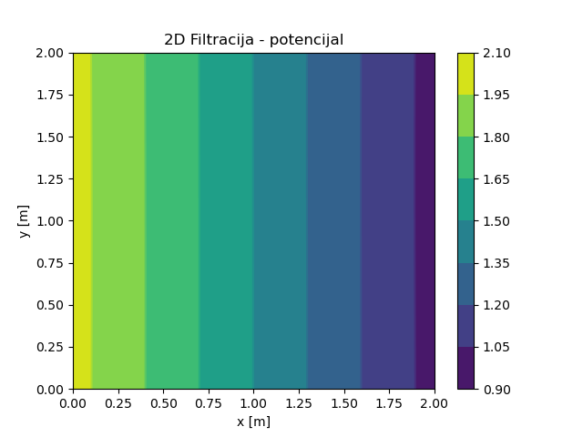
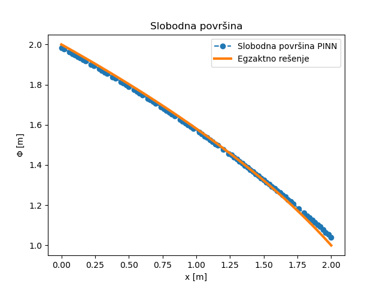
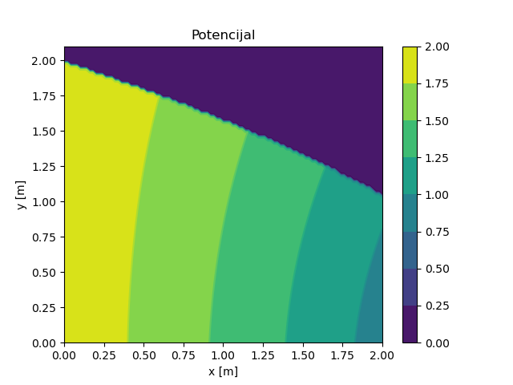

.. _podzemne:

Струјање подземних вода
================================

Основна величина од које се полази у теорији струјања течности кроз порозно тло је потенцијал :math:`\phi` дефинисан као

.. math:: 
    \phi = \frac{p}{\gamma} + h, 

где је :math:`p` притисак течности, :math:`\gamma` специфична тежина, а :math:`h` висина мерена у односу на изабрану референтну раван. Брзина течности :math:`\mathbf{q}`, позната и као Дарсијева брзина, представља запремину течности која прође у јединици времена кроз јединичну површину порозне средине. Она се може изразити помоћу потенцијала :math:`\phi` релацијом која се зове Дарсијев закон:

.. math:: 
    \mathbf{q} = -\mathbf{K} \nabla \phi, 

где је :math:`\mathbf{K}` матрица пермеабилности која за ортотропни материјал има облик

.. math:: 
    \mathbf{K} = 
    \begin{bmatrix}
    k_x & 0 & 0 \\
    0 & k_y & 0 \\
    0 & 0 & k_z 
    \end{bmatrix}, 

где су :math:`k_x`, :math:`k_y` и :math:`k_z` коефицијенти пермеабилности у одговарајућим правцима. Компонентни облик једначине је према томе:

.. math:: 
    q_x = -k_x \frac{\partial \phi}{\partial x}, \\
    q_y = -k_y \frac{\partial \phi}{\partial y}, \\
    q_z = -k_z \frac{\partial \phi}{\partial z}.

Сада у систем уводимо једначину континуитета. У случају стационарног струјања нестишљивог флуида, каква је вода, једначина континуитета има облик

.. math:: 
    \nabla^T \mathbf{q} = 0,

или уз коришћење Дарсијевог закона

.. math:: 
    \frac{\partial}{\partial x}\left( k_x \frac{\partial \phi}{\partial x} \right) +
    \frac{\partial}{\partial y}\left( k_y \frac{\partial \phi}{\partial y} \right) +
    \frac{\partial}{\partial z}\left( k_z \frac{\partial \phi}{\partial z} \right) = 0

У случају када се промена коефицијената :math:`k_x, k_y, k_z` са координатама може занемарити, што је најчешћи случај, једначина се своди на

.. math:: 
    k_x \frac{\partial^2\phi}{\partial x^2} +
    k_y \frac{\partial^2\phi}{\partial y^2} +
    k_z \frac{\partial^2\phi}{\partial z^2} = 0

Коначно, ако постоји извор и/или понор, за стационарне услове, **хидродинамичка једначина** има следећи облик:

.. math:: 
    :label: eq:hidrodinamicka

    k_x \frac{\partial^2\phi}{\partial x^2} +
    k_y \frac{\partial^2\phi}{\partial y^2} +
    k_z \frac{\partial^2\phi}{\partial z^2} + \bar{Q}= 0

где је :math:`\bar{Q}` запремински флукс (извор или понор, као количина течности по јединици запремине порозне средине у јединици времена). Гранични услови који се срећу у решавању проблема струјања кроз порозну средину описаног горњим једначинама приказани су на :numref:`filtracija-granicni-uslovi`.

.. _filtracija-granicni-uslovi:

    Различити гранични услови код проблема филтрације у две димензије. 

Они могу бити:

#. **задати потенцијал**
    .. math::
        \phi = \bar{\phi}, \qquad \mid \Gamma_1

#. **задати површински проток (флукс)**
    .. math::
        q_n = \bar{q} \qquad \mid \Gamma_2
	
#. **слободна површина**

    .. math::
        :label: eq:uslov-sp

        p=0, \, \phi=y, \, \frac{\partial \phi}{\partial n}=0 \qquad \mid  \Gamma_3

Приметимо да је на слободној површини :math:`\phi=y`. Пошто се облик слободне површине не зна, то је њено одређивање посебан задатак у овој области. И овај проблем ћемо покушати да покријемо методом НМПФЗ. 

Стационарно струјање кроз порозну средину
---------------------------------------------

Дводимензионално стационарно течење кроз порозни медијум је регулисано константном разликом потенцијала на две површине. Проток се јавља између два непропусна слоја у правоугаоној геометрији димензија *2m x 2m*, као на :numref:`hidrologija-bc-bez-sp`.

.. _hidrologija-bc-bez-sp:

.. figure:: hidrologija-bc-bez-sp.png
    :width: 60%

    Поставка проблема стационарног струјања кроз порозну средину без слободне површине

Имплементација проблема је једноставна и њени најважнији делови се налазе на следећем листингу. 

.. code-block:: python
    :caption: Решење проблема струјања без слободне површине у 2Д коришћењем SCIANN библиотеке
    :linenos:

    # Osnovni grid
    x_data, y_data = np.meshgrid(
        np.linspace(0, 2, 201), 
        np.linspace(0, 2, 201)
    )

    # Modeluje se phi(x,y)
    x = sn.Variable('x')
    y = sn.Variable('y')
    phi = sn.Functional('phi', [x,y], 4*[30], 'sigmoid')

    # %%
    k = 1.е-5
    TOL = 0.015

    # Osnovna jednacina
    fun1 = k * (diff(phi, x, order=2) + diff(phi, y, order=2))

    # Dirihleovi granicni uslovi
    C1 = (1-sign(x - (0+TOL))) * (phi-2)
    C2 = (1+sign(x - (2-TOL))) * (phi-1) 

    # Njumanovi granicni uslovi
    N1 = (1-sign(y - (0+TOL))) * diff(phi,y)
    N2 = (1+sign(y - (2-TOL))) * diff(phi,y)

    # FZNN model
    m2 = sn.SciModel([x,y], [fun1, C1, C2, N1, N2],  optimizer='Adam')

    # Trening
    pinn_model = m2.train([x_data, y_data], 5*['zero'], learning_rate=0.001, batch_size=1024, epochs=100, stop_loss_value=1E-15)

Са свим овим поставкама смо се мање-више већ сретали, осим што до сада нисмо имали 2Д стационарни проблем. Постављамо равномерну мрежу колокационих тачака у димензијама домена (*2m x 2m*), затим дефинишем функционал :math:`\Phi(x,y)` и диференцијалну једначину проблема. Приметимо да решење уопште не би требало да зависи од коефицијента :math:`k`. Следећи корак је поставка Дирихлеових граничних услова на левом (:math:`\Phi_1=2m`) и на десном (:math:`\Phi_1=1m`) крају домена, тј. на вертикалама :math:`x_1=0m` и :math:`x=2m`, респективно:

.. code-block:: python

    C1 = (1-sign(x - (0+TOL))) * (phi-2)
    C2 = (1+sign(x - (2-TOL))) * (phi-1)

Недостају само још Нојманови гранични услови који јамче да су доња (:math:`y=0`) и горња (:math:`y=2m`) површина непропусне, тј. да је извод потенцијала по :math:`y` једнак нули:

.. code-block:: python

    N1 = (1-sign(y - (0+TOL))) * diff(phi,y)
    N2 = (1+sign(y - (2-TOL))) * diff(phi,y)

Када се постави проблем, решење се назире већ за неколико десетина епоха тренирања. Аналитичко решење за потенцијал је, према :cite:t:`bear2012hydraulics`:

.. math:: 
    \phi = \Phi_1 - \frac{\Phi_1-\Phi_2}{L} (x-x_1)

где је :math:`L=x_2-x_1`. Дакле, поље потенцијала је константно у односу на :math:`Y` осу, док је градијент потенцијала константан у правцу :math:`X` осе. 

.. _bez-slobodne-povrsine-res1:

.. figure:: 2d-filtracija-bez-sp1.png
    :width: 80%

    НМПФЗ решење потенцијала дуж :math:`X` осе за 2Д случај струјања без слободне површине.

Поређење аналитичког и НМПФЗ решења је приказано на :numref:`bez-slobodne-povrsine-res1`, а поље потенцијала је приказано на :numref:`bez-slobodne-povrsine-res2`. Униформност потенцијалног поља у :math:`Y` смеру, додатно потврђује тачност 2Д НМПФЗ решења за овај стационарни проблем.

.. _bez-slobodne-povrsine-res2:

    НМПФЗ решење поља потенцијала за 2Д случај струјања без слободне површине.

Стационарно струјање кроз порозну средину са слободном површином
---------------------------------------------------------------------

Стационарно течење кроз порозни медијум, са слободном површином је регулисано константном разликом потенцијала на две супротне површине, као што је приказано на :numref:`hidrologija-bc-sp`. Доња површина је непропусна. Геометријски и материјални подаци, као и гранични услови, такође су дати на :numref:`hidrologija-bc-sp`.

.. _hidrologija-bc-sp:

    Поставка проблема стационарног струјања кроз порозну средину са слободном површином

Вредности потенцијала у колокационим тачкама на површини :math:`x_1=0` су :math:`\Phi_1=2m` док су у тачкама на линији :math:`x_2=2m` вредности :math:`\Phi_2=1m`. Доња површина је непропусна, па на њој задајемо да је градијент потенцијала нула. Дакле, и Дирихлеови и Нојманови гранични услови су идентични као и у претходном примеру који није укључивао постојање слободне површине. Међутим, њено постојање је физички нужно и дефинисано условима :math:numref:`eq:uslov-sp`. 

Како бисмо имплементирали овај гранични услов, морамо да израчунамо правац нормале:

.. code-block:: python

    k1 = diff(phi,x)
    alpha = atan(k1)+np.pi/2
    nx = cos(alpha)
    ny = sin(alpha)

који ћемо добити тиме што додамо угао :math:`\frac{\pi}{2}` правцу тангенте на ``phi``, коју израчунавамо захваљујући тривијалној доступности првог извода у НМПФЗ методологији. Након тога лако израчунавамо компоненте нормале ``nx`` и ``ny``. Гранични услов слободне површине постављамо на исти начин као и раније када смо користили библиотеку SCIANN, тако што се у виду конјункције наводи где услов важи и шта у том делу домена важи. Међутим, овог пута немамо строго дефинисане координате, јер положај слободне површине не знамо. Оно што знамо је да је на читавој слободној површини :math:`\phi=y`, па ово наводимо као област важења:

.. code-block:: python

    FS1 = (abs(y-phi)<0.009) * k * (diff(phi,x)*nx + diff(phi,y)*ny)

док услов непостојања протока кроз слободну површину :math:`\frac{\partial \phi}{\partial n} = \frac{\partial \phi}{\partial x} n_x + \frac{\partial \phi}{\partial y} n_y=0` наводимо као главну компоненту. 

Потребно је обезбедити и довољан број колокационих тачака да би се исправно испратио облик слободне површине. То ћемо обезбедити тако што у делу домена у коме очекујемо појаву слободне површине концентрацију колокационих тачака повећамо (у нашој имплементацији четири пута). Како је у питању чисто техничко решење, овде се тиме нећемо бавити, већ читаоца упућујемо на комплетан пример. 

Аналитичко решење за потенцијал за овај једноставан проблем се по :cite:t:`bear2012hydraulics`, може се написати у облику 

.. math:: 
    \phi = \sqrt{\Phi_1^2 - 2B (x-x_1)},

где је

.. math:: 
    B = \frac{\Phi_1^2-\Phi_2^2}{2L}

и :math:`L=x_2-x_1`. Поређење НМПФЗ решења са аналитичким решењем може се видети на :numref:`slobodna-povrsina-res1`. Поље потенцијала је приказано на :numref:`slobodnа-povrsinа-res2`. 

.. _slobodna-povrsina-res1:

    НМПФЗ решење потенцијала дуж :math:`X` осе за 2Д случај струјања са слободном површином.

.. _slobodnа-povrsinа-res2:

    НМПФЗ решење поља потенцијала за 2Д случај струјања са слободном површином.

Може се приметити релативно добро слагање НМПФЗ решења са аналитичким решењем, као и очигледна разлика распореда поља потенцијала у односу на случај без слободне површине приказан на :numref:`bez-slobodne-povrsine-res2`. Ако пак упоредимо приступ решавању проблема слободне површине методом НМПФЗ са класичном методом коначних елемената код :cite:t:`kojic1998metod`, можемо приметити да је НМПФЗ приступ једноставнији. Разлог томе је што се код НМПФЗ не захтева никакав посебан нумерички третман и употреба нумеричких претпоставки, већ се физика проблема директним путем преводи у НМПФЗ гранични услов. 
