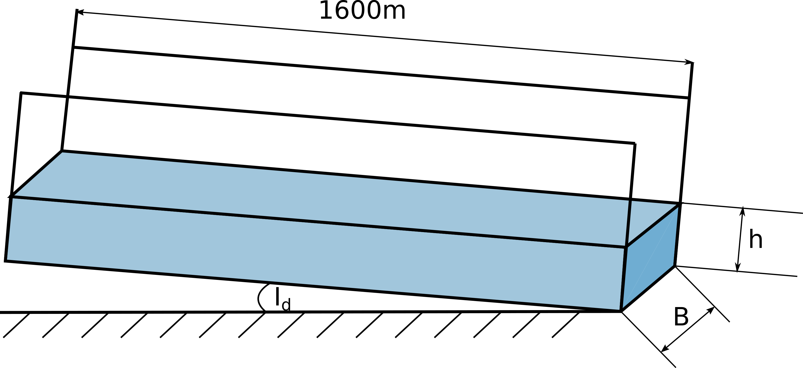
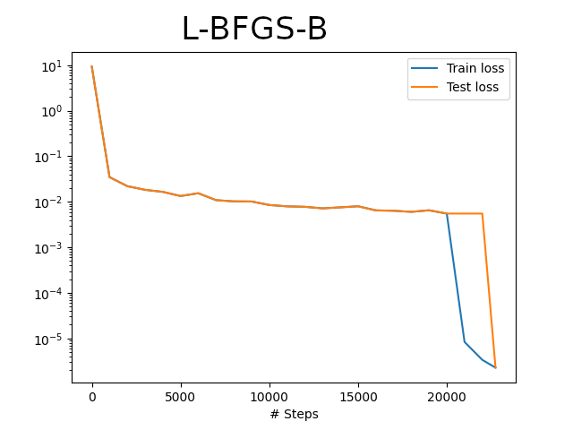
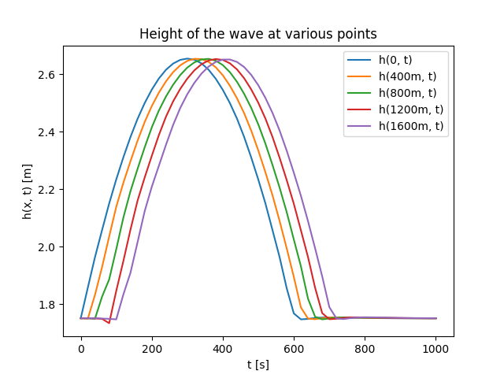
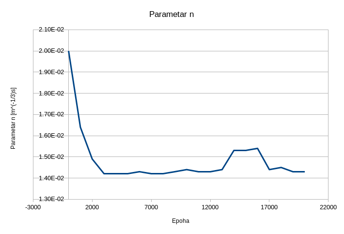

.. _poplavni:

Пропагација таласа у отвореном каналу
==================================================

Управљање водним ресурсима захтева алате за дугорочно и краткорочно предвиђање различитих хидролошких феномена. Предвиђање је значајно у областима управљања ризиком од поплава, управљања хидро-електранама, унутрашње пловидбе, водоснабдевања, итд. Бројни задаци у вези са предвиђањем хидролошких података успешно су обрађени коришћењем приступа предвиђања заснованог на класичном нумеричком моделовању. Иако овај приступ даје задовољавајуће резултате, још увек има много проблема које треба решити. У многим случајевима, време израчунавања је параметар који може ограничити примену физички заснованих хидролошких и хидрауличких модела у реалној примени. Поред тога, физички засновани модели су недовољно флексибилни у случајевима инверзних проблема, идентификације параметара, асимилације мерених података итд. 

Модели предвиђања засновани на неуронским мрежама примењени су у моделовању падавина и отицаја :cite:t:`chadalawada2020hydrologically`, системима раног упозорења на поплаве :cite:t:`duncan2013rapids`, као и моделовању урбаних водоводних мрежа :cite:t:`garzon2022machine`. Ови приступи захтевају велику количину података за обуку, што може створити проблеме уколико нема довољно података. Поред тога, може се приметити да ова врста модела није у стању да испоручи добре резултате када улазни подаци излазе изван опсега података који се користе за обуку. У овим случајевима, модели засновани на неуронским мрежама могу произвести физички немогуће резултате. У последњих неколико година, убрзано се уводи НМПФЗ приступ и у овој области. У наредном примеру ћемо сагледати потенцијал употребе НМПФЗ у једнодимензионом проблему пропагације поплавног таласа у отвореним каналима спајањем физичког закона са почетним и граничним условима описаним кинематичком једначином пропагације таласа.

Усмеравање поплава - физички закони
-------------------------------------

Простирање поплавног таласа у отвореним каналима је описано помоћу две једначине, и то **једначином континуитета** :math:numref:`eq:poplava-kontinuitet` и **законом одржања количине кретања** :math:numref:`eq:poplava-dinamicka`. Ова једначина садржи утицаје трења, гравитације, силе притиска, као и локалног и конвективног убрзања. У овом примеру, простирање таласа у правоугаоном каналу је представљено кинематичким таласом који поједностављује динамичку једначину, узимајући само утицај трења и гравитације:

.. math:: 
  :label: eq:poplava-kontinuitet

  \frac{\partial h(x,t)}{\partial t} + c \frac{\partial h(x,t)}{\partial x} = 0 

.. math:: 
  :label: eq:poplava-dinamicka
  
  Q(x,t) = \frac{1}{n} \cdot B \cdot h(x,t)^\frac{5}{3} \cdot \sqrt{I_d},

где :math:`h \, [m]` представља дубину воде, :math:`t \, [s]` је време, :math:`x \, [m]` просторну координату, :math:`c \, [m/s]` брзину пропагације поремећаја, :math:`Q [m^3/s]`` проток, :math:`n [m^{-\frac{1}{3}}s]` репрезентује Манингову храпавост, :math:`B \, [m]` ширину попречног пресека и :math:`I_d` нагиб по уздужној оси. 

Циљ моделовања простирања таласа је процена промене дубине воде дуж канала :math:`h(x,t)` која је изазвана поплавним таласом представљеним хидрограмом тока :math:`Q_{in}(t) = Q(0,t)` на узводном крају канала.

Конструкција функције губитка
-------------------------------

Ако се осврнемо на општи израз за функцију губитка :math:numref:`eq:loss1`, видимо три компоненте, и то губитак који потиче од резидуалне мреже, губитак који потиче од почетних услова и губитак који потиче од граничних услова. Кренимо редом. Компонента функције губитка која потиче од диференцијалне једначине :math:numref:`eq:poplava-kontinuitet` дефинисана је десном страном исте једначине. Компонента почетних услова се дефинише као:

.. math:: 
  h(x,t=0) = h_0

Поред тога, потребан нам је и гранични услов који дефинише вредност висине таласа на почетку моделованог домена, тј. на :math:`x=0` одакле талас долази. Тај гранични услов изводимо из динамичке једначине :math:numref:`eq:poplava-dinamicka`:

.. math:: 
  h(0,t) = \left(  \frac{Q_{in}(t) \cdot n}{B \cdot \sqrt{I_d}}  \right)^\frac{3}{5}.

Уколико као меру грешке усвојимо средњу квадратну грешку (*Mean Squared Error - MSE*), композитна функција губитка изгледаће овако:

.. math:: 
  MSE = MSE_r + MSE_0 + MSE_b,

где су:

.. math:: 
  MSE_r = \frac{1}{N_{x_f,t_f}} \sum \left| r(x_f, t_f) \right|^2, \\
  MSE_0 = \frac{1}{N_{x_0,t_0}} \sum \left| \tilde{h}(x_0,0)-h(x_0,0) \right|^2, \\
  MSE_b = \frac{1}{N_{x_b,t_b}} \sum \left| \tilde{h}(0,t_b)-h(0,t_b) \right|^2.

Овде су :math:`N_{x_f,t_f}`, :math:`N_{x_0,t_0}` и :math:`N_{x_b,t_b}` укупни бројеви колокационих тачака у унутрашњости моделованог домена, за почетне и за граничне услове, респективно. 
 

Тест пример и имплементација
-----------------------------

Пример на коме ћемо тестирати ваљаност нашег НМПФЗ приступа за моделовање ширења поплавног таласа је пропагација таласа дуж канала дугог 1600 метара, облика призме и правоугаоног попречног пресека широког 15 метара, као на :numref:`poplavni-postavka`. 

.. _poplavni-postavka:

    Поставка проблема пропагације поплавног таласа у времену.

Манингова храпавост има вредност од :math:`n = 0,015 m^{-\frac{1}{3}}s`, нагиб је постављен на :math:`I_d=0,005`, a брзина пропагације на :math:`c=15 \, m/s`. Циљ је израчунати промене дубине и протока воде дуж канала, изазване поплавним таласом генерисаним као узводни гранични услов на :math:`x=0`:

.. math:: 
  Q_{in}(t) = Q(0,t) = 180 \cdot \left[  1 + \left( -\frac{sgn(t-600)}{2} + \frac{1}{2} \right) \cdot \sin \left( \frac{\pi t}{600} \right)  \right].

Поред овог услова, ту је и почетни услов Дирихлеовог типа, а то је да је висина воде у каналу :math:`h(x,t=0)=1,751m`. Интересантни делови решења приказани су на  :numref:`listing-poplavni`.

.. _listing-poplavni:

.. code-block:: python
    :caption: Решење проблема пропагације поплавног таласа коришћењем DeepXDE оквира
    :linenos:

    import deepxde as dde
    import numpy as np
    import pandas as pd
    import matplotlib.pyplot as plt
    from deepxde.backend import tf

    c = 15 # brzina propagacije talasa
    n = 0.015 # hrapavost kanala
    Id = 0.005 # nagib dna kanala
    B = 15 # poprecni presek
    length = 1600
    total_time = 1000.0

    # Hiperparametri
    layers = [2] + [30] * 4 + [1]
    activation = 'tanh'
    initializer = 'Glorot uniform'
    optimizer = 'rmsprop'
    batch_size = 128
    num_of_epochs = 20000
    learning_rate = 0.001
    loss = 'mse'

    # Jednacina kontinuiteta
    def pde(x, h):
        dh_t = dde.grad.jacobian(h, x, i = 0, j = 1) 
        dh_x = dde.grad.jacobian(h, x, i = 0, j = 0)
        return dh_t + c * dh_x

    # Da li je t=0?
    def initial_h(x, on_boundary):
        return on_boundary and np.isclose(x[1], 0)

    # Da li je x=0?
    def boundary_hx0(x, on_boundary):
        return on_boundary and np.isclose(x[0], 0)

    # Pocetni uslov za visinu vode x(t=0)
    def func_init_h(x):
        return 1.751

    # Dirihleov granicni uslov - Profil poplavnog talasa u vremenu
    def func_hx0(x):
        t = x[:, 1:2]
        
        Qin = 180 * (1 + (-(np.sign(t - 600) / 2) + 0.5) * np.sin(t *  np.pi / 600))
        a = Qin * n
        b = B * np.sqrt(Id)
        c = a / b
        return custom_pow(c, 3/5)

    time_domain = dde.geometry.TimeDomain(0, total_time)
    geom_domain = dde.geometry.Interval(0, length)
    geotime = dde.geometry.GeometryXTime(geom_domain, time_domain)

    # Realizacija granicnog i pocetnog uslova
    bc = dde.icbc.DirichletBC(geotime, func = func_hx0, on_boundary = boundary_hx0)
    ic = dde.icbc.IC(geotime, func = func_init_h, on_initial = initial_h)

    # Konstrukcija modela i definisanje kolokacionih tacaka
    data = dde.data.TimePDE(geotime, pde, [bc, ic], num_domain = 16000, num_boundary = 1000, 
          num_initial = 100, train_distribution = 'uniform')
    net = dde.nn.FNN(layers, activation, initializer)
    model = dde.Model(data, net)

    # Treniranje RMSProp metodom 
    model.compile(optimizer = optimizer, loss = loss, lr = learning_rate)
    loss_history, train_state = model.train(epochs = num_of_epochs, display_every = 1000, batch_size = batch_size)

    # Dodatno treniranje L-BFGS-B metodom posle RMSprop optimizacije
    model.compile("L-BFGS-B")
    loss_history, train_state = model.train()

У овој скрипти одмах на почетку дефинишемо и физичке параметре проблема и хипер-параметре модела. Погледом на групу хипер-параметара одмах може да се примети значајно већи број епоха за тренинг, као и оптимизатор ``RMSProp`` уместо стандардног ``Adam`` оптимизатора. ``Adam`` оптимизатор приликом рачунања градијента користи и први и други извод (момент), док ``RMSProp`` користи само други извод. Током експериментисања са различитим хипер-параметрима, испоставило се да за овај конкретан пример ``RMSProp`` заиста нешто брже конвергира. Такође, показало се да је пример у неким сценаријима осетљив чак и на избор ``batch_size`` и иницијализатора тежина. Пракса је показала да је уз активационе функције као што су ``sigmoid`` или ``tanh`` боље користити ``Glorot`` иницијализатор, док уз активациону функцију ``relu`` боље иде ``He``, по :cite:t:`katanforoosh2019initializing`. 

На жалост, око избора хипер-параметара не постоје строга правила. Све зависи од самог примера, па се избор оптималних хипер-параметара за неки конкретан проблем углавном своди на мануелну, временски захтевну процедуру. Помоћу алата као што је *Tensorflow/Keras* може се донекле умањити овај проблем једноставним алгоритмима као што је насумична претрага (*Random Grid Search*), која захтева огромне рачунарске ресурсе да би се добили иоле употребљиви резултати. С друге стране, постоји неколико алата који ову претрагу чине ефикаснијом паметнијим приступом оптимизацији. На пример, алат `Blackfox <https://blackfox.ai>`_ користи дистрибуирани генетски алгоритам, а проблем хардверских ресурса решава дистрибуираном обуком на локалном *Kubernetes* кластеру или кластеру постављеном на неком клауд провајдеру. 

Следи поставка почетног Дирихлеовог услова за ниво воде у каналу и нешто сложенијег граничног услова за висину воде :math:`h` који се мења у времену по једначини :math:numref:`eq:poplava-dinamicka`. Овде само треба нагласити да се код DeepXDE улази :math:`x` и :math:`t` задају као један двоколонски тензор, у коме је:

.. code-block:: python

    x[:, 0:1] # ulaz x
    x[:, 1:2] # ulaz t
  
Како је у питању динамички проблем који покрива релативно велики просторни и временски домен, тј. прати се линија од 1,6 km током приближно 17 минута, потребан је и већи број колокационих тачака него у неким проблемима које смо раније обрађивали. Модел се поставља као:

.. code-block:: python

      data = dde.data.TimePDE(geotime, pde, [bc, ic], num_domain = 16000, num_boundary = 1000, 
        num_initial = 100, train_distribution = 'uniform')

Бројност колокационих тачака за почетне и граничне услове прати бројност тачака унутар домена. Након стандардног тренирања методом ``RMSProp`` примећујемо још једну специфичност у односу на једноставније примере. Наиме, након што се обави "глобална" претрага, алгоритам *Limited Memory Broyden-Fletcher-Goldfarb-Shanno* има прилику да се додатно приближи оптималном решењу према :cite:t:`markidis2021old`: 

.. code-block:: python

    model.compile("L-BFGS-B")
    loss_history, train_state = model.train()

Примећујемо да се овде не наводи број епоха, већ се алгоритам ослања на аутоматску детекцију конвергенције. График функције губитка се може видети на :numref:`poplavni-loss2`, где до 20.000. епохе, као што је већ речено, тече ``RMSProp``, а онда се у локалној околини наставља са ``L-BFGS-B``. Веома је уочљив раст перформанси тренирања, тј. пад вредности функције губитка у том делу. 

.. _poplavni-loss2:

    Почетно тренирање методом *RMSProp* у 20.000 епоха и додатно тренирање методом *L-BFGS-B* до детектоване конвергенције

Што се самог процеса тренирања ове НМПФЗ тиче, треба нагласити да је за оволику количину података, тј. колокационих тачака, тај процес далеко брже ради на графичком процесору него на стандардном процесору. Слободна процена је да је тренирање на *Tesla T4* графичком процесору више од 10 пута брже него на процесору *Intel Xeon Silver 4208 @ 2.10GHz*. 

Коначно долазимо и до резултата. Висина воденог стуба у више контролних тачака (0, 400m, 800m, 1200m, 1600m) приказана је на :numref:`poplavni-rezultati`. Ова решења се добро поклапају са решењима које даје метода коначних разлика, али то поређење овде нећемо приказивати. 

.. _poplavni-rezultati:

    Висина воденог таласа у неколико тачака током времена 

Инверзни проблем
---------------------

Пошто смо успешно решили директни проблем, хајде да замислимо ситуацију да нам није познат параметар :math:`n` који репрезентује Манингову храпавост, али да смо посматрањем кретања таласа утврдили да је његов врх висине 2,65m прошао кроз контролне тачке (0, 400m, 800m, 1200m, 1600m) у следећим тренуцима:

============ ====== ====== ====== ======= ======= 
 **x [m]**    0      400    800    1200    1600   
============ ====== ====== ====== ======= ======= 
 **t [s]**    300    320    360    380     400    
============ ====== ====== ====== ======= ======= 

Ове опсервације чине могућим креирање ``PointSet`` граничног услова који смо већ користили, а то се код DeepXDE оквира ради на следећи начин:

.. code-block:: python

    bc_x = np.array([[0,300],[400,320],[800,360],[1200,380],[1600,400]]).reshape(5,2)
    bc_y = np.array([2.65,2.65,2.65,2.65,2.65]).reshape(5,1)
    ic3 = dde.icbc.PointSetBC(bc_x, bc_y, component=0)

Резултати висине воденог стуба су приказани на :numref:`poplavni-inverzni1`, док је вредност параметра :math:`n` током обуке приказана на :numref:`poplavni-parametar-n`.

.. _poplavni-inverzni1:

    Висина воденог стуба код инверзног проблема

.. _poplavni-parametar-n:

    Вредност непознатог параметра :math:`n` током обуке

Видимо да се НМПФЗ и у овом проблему доста добро сналази са инверзном поставком. Још једном ваља нагласити да се код НМПФЗ директни и инверзни приступ методолошки уопште не разликују и да захтевају исту количину рачунарских ресурса. Насупрот томе, класичне нумеричке методе као МКЕ су у стању да реше искључиво директне проблеме. За индентификацију параметара код МКЕ морају да се користе методе за конвексну или чешће, неконвексну оптимизацију које су у реалним применама рачунарски веома захтевне, а понекад и нерешиве. 

Наравно, ни НМПФЗ није идеалан. Успешност обуке и овом примеру много зависи од избора хипер-параметара, а често се дешава да услед стохастичког карактера саме обуке ни исти хипер-параметри не доводе до решења баш у сваком тренингу. Поред хипер-параметара, овде имамо и почетну вредност непознатог физичког параметра (или више параметара), па се неретко дешава да оптимизација за неке почетне вредности уопште не конвергира, задржавајући се у неком локалном минимуму. 
