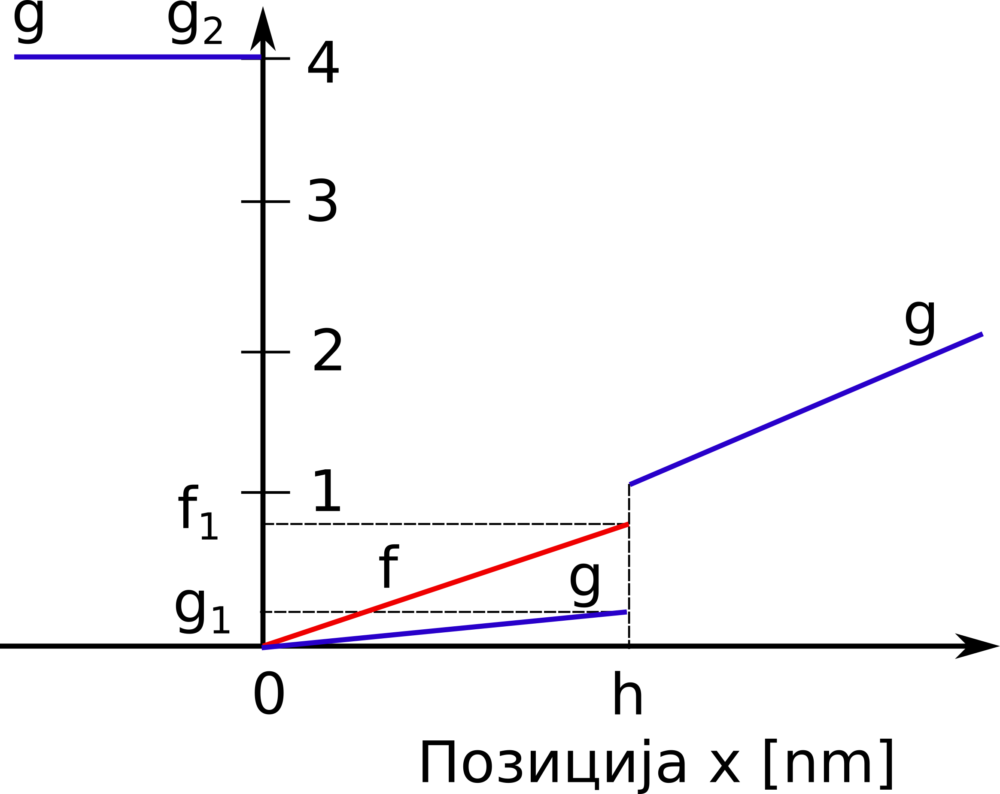

Увод
=======

Хаксли и Хоџкин су 1957. године развили биофизички модел који је био основа за сва наредна истраживања у овој области :cite:t:`huxley1957muscle`. Природа Хакслијевог модела се ослања на динамику попречних мостова, због чега је сама теорија и названа теорија попречних мостова :cite:t:`huxley1957muscle`. Хаксли је разматрао половину саркомере и сматрао је да су главе миозина за миозински филамент причвршћене помоћу еластичних веза. На :numref:`huxley1` имамо шематску репрезентацију модела, на којој се може уочити да је дебели миозински филамент фиксиран у простору за М-линију. Приликом стимулације мишића очекивано је да се миозинске главе вежу на најближе слободно место на актину, услед чега долази до формирања еластичних веза у виду попречних мостова. У том тренутку долази до генерисања активне мишићне силе.

.. _huxley1:

    Хакслијев модела клизајућих филамената

Сила се тада преноси на актински филамент који се том приликом креће ка Z-линији. Процес формирања попречних мостова се понавља услед сталног релативног клизања
актинског филамента дуж миозинског и зависи од положаја самих миозинских глава. Том приликом, попречни мостови трпе истезања и скраћивања. Због сталног релативног
клизања филамената Хакслијева теорија се назива и теоријом клизајућих филамената :cite:t:`huxley1957muscle`. 

У случају издужења мишића, актински филамент клизи удесно, дуж миозинског филамента, који је фиксиран за М-линију. Померање главе миозина од њене усправне позиције, у правцу М-линије или Z-линије до активног места А на актинском филаменту, означено је са *x* и тумачи се као дужина попречног моста. У једном тренутку, миозинска глава може бити везана само за једно активно место актина, при чему je померање ограничено максималним померањем главе миозина, изазваним термалним флуктуацијама, *h* , тако да важи :math:`0<x<h`.Уколико дужина попречног моста постане већа од *h* , долази до раскидања ове везе између филамената. У сваком тренутку је могуће идентификовати да ли је нека миозинска глава закачена или не, и да ли том приликом формира попречни мост дужине *x*. Вероватноћа да случајно изабрана миозинска глава у тренутку *t* формира попречни мост дужине *x* из домена :math:`\Omega` , означена је са :math:`n(x,t)`. 

Вероватноћа :math:`n(x,t)` се може тумачити и као удео броја миозинских глава које су у тренутку *t* закачене на растојању *x* у односу на укупан број миозинских глава. Овај број зависи од брзине успостављања и раскидања попречних мостова, тако да се континуиран процес стварања и раскидања попречних мостова може формулисати једначином:

.. math:: 
    :label: eq:huxley1

    \frac{dn(x,t)}{dt} = \left[  1-n(x,t) \right] f(x) - n(x,t) g(x)

где су :math:`f(x)` и :math:`g(x)` редом стопе успостављања и раскидања везе између миозина и актина у јединици времена, које зависе од растојања *x*, као на :numref:`fg`. Вероватноћа успостављања везе је представљена производом удела оних миозинских глава које још увек нису закачене, :math:`1-n(x,t)`, и стопе успостављања везе, :math:`f(x)`. С друге стране, вероватноћа да се успостављена веза између актина и миозина прекине је дата као :math:`n(x,t) g(x)`. 

.. _fg:

    Стопе успостављања везе, *f*, (наранџаста линија) и раскидања везе, *g*, (плава линија) између миозина и актина

Хакслијева теорија кинетике попречних мостова се може изразити коришћењем парцијалне диференцијалне једначине над доменом :math:`\Omega`:

.. math:: 
    \frac{\partial n}{\partial t} (x,t) - v \frac{\partial n}{\partial x} = \mathcal{N} \left( n(x,t), x\right), \qquad \forall x \in \Omega

где је :math:`v= -dx/dt` брзина клизања филамента актина у односу на филамент миозина (позитивна при контракцији), а

.. math:: 
    \mathcal{N} \left( n(x,t), x\right) = \left[  1-n(x,t) \right] f(x) - n(x,t) g(x)

представља брзину промене стања попречних мостова.

У циљу што реалистичнијег описа понашања мишића током издужења, Захалак је увео одређене модификације оригиналног Хакслијевог модела. Увео је минималне промене у дефиницији стопа успостављања и раскидања веза између миозина и актина, тако да је при скраћивању мишића све остало непромењено, док је при издужењу омогућио већу стопу откачињања. Ово је практично реализовано тако што је уведен Захалак фактор, :math:`f_{Zah}`, у случају када је дужина попречног моста *x*
већа од *h*:

.. math::
    :label: eq:fg

    x<0 \quad : \quad f(x)=0; \, g(x)=g_2; \\ 
    0 \le x \le h \quad : \quad f(x)=f_1 x/h; \, g(x)=g_1 x/h; \\
    x>h \quad : \quad f(x)=0; \, g(x)=f_{Zah} \, g_1 x / h 

Може се уочити да је у области :math:`x<0` дефинисана висока вредност стопе откачињања, :math:`g(x)=g_2` , како би се попречни мостови који су доспели у ову зону брзо прекинули. Постоји извесна стопа откачињања и у области :math:`0<x<h` али је мала у поређењу са негативном облашћу. 

Након завршене обуке неуронске мреже, она се може користити као замена за **метод карактеристика** објашњен у :cite:t:`svivcevic2020vivseskalni`. Овде ћемо се зауставити са објашњавањем математичког модела, а читаоца који се интересује за изучавање ове области упутити на :cite:t:`svivcevic2020vivseskalni`.

Изометријски случај
----------------------

У овој секцији биће дати резултати постигнути неуронским мрежама информисаним Хакслијевом једначином за мишићну контракцију. Ради тестирања способности ових неуронских мрежа да решавају парцијалне диференцијалне једначине, најпре је од интереса изометријски случај, јер је он једноставнији будући да је **брзина клизања филамената једнака нули**. Код изометријског случаја, вишеслојни перцептрон као улаз узима позицију (*x*) доступног актинскиг сајта у односу на равнотежни положај миозинске главе и време (*t*), а предвиђа вероватноће закачињања миозинских глава за актинске сајтове *n(x,t)*. Комплетан код је дат на следећем листингу.

.. code-block:: python

    :caption: Решење проблема простирања таласа у 2Д домену са сочивом
    :linenos:

    import deepxde as dde
    import numpy as np
    import tensorflow as tf

    ''' fixed parameters ''' 
    f1_0 = 43.3 
    h = 15.6
    g1 = 10.0
    g2 = 209.0
    fzah = 4.0
    a = 1.

    # Verovatnoca kacenja
    def f(x,a):
        return (1+tf.sign(x)) * (1-tf.sign(x-h)) * (f1_0*a*x/h) * 0.25

    # Verovatnoca raskacivanja
    def g(x):
        return 0.5 * (1-tf.sign(x)) * g2 + \
            0.25 * (1+tf.sign(x)) * (1-tf.sign(x-h)) * (g1*x/h) + \
            0.5 * (1+tf.sign(x-h)) * (fzah*g1*x/h)

    # n = n(x,t)
    def pde(x, n):
        dn_dt = dde.grad.jacobian(n, x, i=0, j=1)
        loss = dn_dt - (1.0-n) * f(x[:,0:1],a) + n*g(x[:,0:1])
        # Obezbedi pozitivna resenja
        return loss + n*(1-tf.sign(n))

    # Computational geometry
    geom = dde.geometry.Interval(-20.8, 63)
    timedomain = dde.geometry.TimeDomain(0, 0.4)
    geomtime = dde.geometry.GeometryXTime(geom, timedomain)

    # Pocetni uslovi
    ic1 = dde.icbc.IC(geomtime, lambda x: 0.0, lambda _, on_initial: on_initial)

    data = dde.data.TimePDE(geomtime, pde, [ic1], num_domain=10000, num_boundary=100, num_initial=500)
    net = dde.nn.FNN([2] + [40] * 3 + [1], "tanh", "Glorot normal")
    model = dde.Model(data, net)

    model.compile("adam", lr=1e-3)
    model.train(100000)
    model.compile("L-BFGS", loss_weights=[1.e-1, 1])
    losshistory, train_state = model.train()
    dde.saveplot(losshistory, train_state, issave=True, isplot=True)

Конструисана је мрежа са 3 слоја, са по 40 неурона и хиперболичном тангентном активационом функцијом. Генерисан је грид података за 10000 еквидистантних вредности за *x* у опсегу :math:`-20.8 [nm] \le  x \le  63 [nm]`  и са 500 насумичних вредности за *t* у опсегу :math:`0 [s] \le t \le  0.4 [s]`. Ове генерисане тачке су коришћене као улазни подаци за обуку мреже. У току обуке, од 100000 епоха, минимизује се резидуал Хакслијеве једначине за мишићну контракцију и резидуал почетног услова, коришћењем Адам оптимизације са стопом учења :math:`10^{-3}`. 

Што се саме имплеементације тиче, треба скренути пажњу на неколико битних момената. Као прво, да бисмо формулисали једначине :math:numref:`eq:fg` не саветује се коришћење услових израза (``if`` клаузула), већ се иста функционалност интерпретира помоћу *TensorFlow* израза за знак, ако се он користи као бекенд. На пример:

.. code-block:: python

    def g(x):
        return 0.5 * (1-tf.sign(x)) * g2 + \
            0.25 * (1+tf.sign(x)) * (1-tf.sign(x-h)) * (g1*x/h) + \
            0.5 * (1+tf.sign(x-h)) * (fzah*g1*x/h)

У функцији парцијалне диференцијалне једначине имамо нешто другачији проблем. Наиме, морамо да обезбедимо да функција :math:`n(x,t)` не почне да узима вредности мање од нуле. Иако сама математичка поставка то дозвољава, подсетимо се да :math:`n(x,t)` означава број закачених сајтова, па негативна вредност нема никаквог физичког смисла. То ћемо урадити на следећ начин:

.. code-block:: python

    def pde(x, n):
        dn_dt = dde.grad.jacobian(n, x, i=0, j=1)
        loss = dn_dt - (1.0-n) * f(x[:,0:1],a) + n*g(x[:,0:1])
        # Obezbedi pozitivna resenja
        return loss + n*(1-tf.sign(n))

У последњој линији се вредности функције губитка додаје члан који има ненулту вредност у случају да је *n* негативно. На први поглед, било би довољно уместо ``n*(1-tf.sign(n))`` поставити само ``1-tf.sign(n)``. Међутим, испоставља се да тако формирана функција губитка не доводи до конвергенције, јер није диференцијабилна, па оптимизациони алгоритми као што је ``Адам`` резултују дивергенцијом. Када се пак функција знака помножи са *n* добијамо диференцијабилнију функцију губитка, а самим тим и већу вероватноћу конвергенције. 

Као и у примеру :ref:`poplavni`, и овде ћемо покушати да додатно смањимо вредност функције губитка методом L-BFGS:

.. code-block:: python

    model.compile("L-BFGS", loss_weights=[1.e-1, 1])
    losshistory, train_state = model.train()
 
Веома је важно испоштовати постављене почетне услове, па ћемо им помоћу ``loss_weights=[1.e-1, 1]`` дати за ред величине већу тежину од компоненте која следи из саме парцијалне диференцијалне једначине. 

