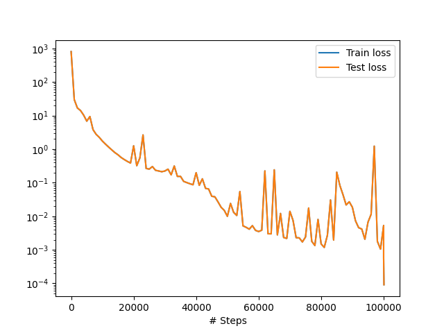
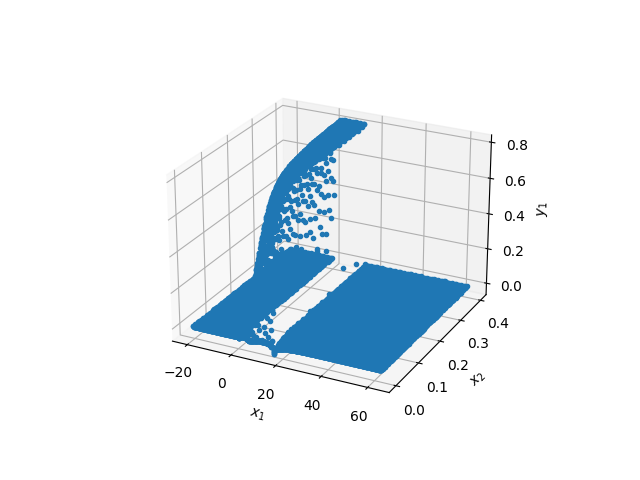
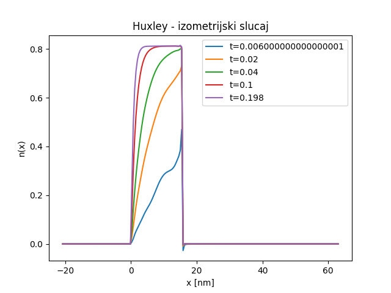

.. _izometrijski:

Изометријски случај
=====================

Ради тестирања способности ФПНМ да решавају ову врсту парцијалних диференцијалних једначина, најпре је од интереса изометријски случај, јер је он најједноставнији будући да је **брзина клизања филамената једнака нули**. Код изометријског случаја, вишеслојни перцептрон као улаз узима позицију (*x*) доступног актинскиг сајта у односу на равнотежни положај миозинске главе и време (*t*), а предвиђа вероватноће закачињања миозинских глава за актинске сајтове *n(x,t)*. 

Имплементација
----------------

Комплетан код је дат на следећем листингу.

.. code-block:: python
    :caption: Решење Хакслијеве једначине за изометријски случај
    :linenos:

    import deepxde as dde
    import numpy as np
    import tensorflow as tf

    ''' fixed parameters ''' 
    f1_0 = 43.3 
    h = 15.6
    g1 = 10.0
    g2 = 209.0
    fzah = 4.0
    a = 1.

    # Verovatnoca kacenja
    def f(x,a):
        return (1+tf.sign(x)) * (1-tf.sign(x-h)) * (f1_0*a*x/h) * 0.25

    # Verovatnoca raskacivanja
    def g(x):
        return 0.5 * (1-tf.sign(x)) * g2 + \
            0.25 * (1+tf.sign(x)) * (1-tf.sign(x-h)) * (g1*x/h) + \
            0.5 * (1+tf.sign(x-h)) * (fzah*g1*x/h)

    # n = n(x,t)
    def pde(x, n):
        dn_dt = dde.grad.jacobian(n, x, i=0, j=1)
        loss = dn_dt - (1.0-n) * f(x[:,0:1],a) + n*g(x[:,0:1])
        # Obezbedi pozitivna resenja
        return loss + n*(1-tf.sign(n))

    # Computational geometry
    geom = dde.geometry.Interval(-20.8, 63)
    timedomain = dde.geometry.TimeDomain(0, 0.4)
    geomtime = dde.geometry.GeometryXTime(geom, timedomain)

    # Pocetni uslovi
    ic1 = dde.icbc.IC(geomtime, lambda x: 0.0, lambda _, on_initial: on_initial)

    data = dde.data.TimePDE(geomtime, pde, [ic1], num_domain=10000, num_boundary=100, num_initial=500)
    net = dde.nn.FNN([2] + [40] * 3 + [1], "tanh", "Glorot normal")
    model = dde.Model(data, net)

    model.compile("adam", lr=1e-3)
    model.train(100000)
    model.compile("L-BFGS", loss_weights=[1.e-1, 1])
    losshistory, train_state = model.train()
    dde.saveplot(losshistory, train_state, issave=True, isplot=True)

Конструисана је мрежа са 3 слоја, са по 40 неурона и хиперболичном тангентном активационом функцијом. Генерисан је грид података за 10000 еквидистантних вредности за *x* у опсегу :math:`-20.8 [nm] \le  x \le  63 [nm]`  и са 500 насумичних вредности за *t* у опсегу :math:`0 [s] \le t \le  0.4 [s]`. Ове генерисане тачке су коришћене као улазни подаци за обуку мреже. У току обуке, од 100000 епоха, минимизује се резидуал Хакслијеве једначине за мишићну контракцију и резидуал почетног услова, коришћењем Адам оптимизације са стопом учења :math:`10^{-3}`. 

Што се саме имплеементације тиче, треба скренути пажњу на неколико битних момената. Као прво, да бисмо формулисали једначине :math:numref:`eq:fg` не саветује се коришћење услових израза (``if`` клаузула), већ се иста функционалност интерпретира помоћу *TensorFlow* израза за знак, ако се он користи као бекенд. На пример:

.. code-block:: python

    def g(x):
        return 0.5 * (1-tf.sign(x)) * g2 + \
            0.25 * (1+tf.sign(x)) * (1-tf.sign(x-h)) * (g1*x/h) + \
            0.5 * (1+tf.sign(x-h)) * (fzah*g1*x/h)

У функцији парцијалне диференцијалне једначине имамо нешто другачији проблем. Наиме, морамо да обезбедимо да функција :math:`n(x,t)` не почне да узима вредности мање од нуле. Иако сама математичка поставка то дозвољава, подсетимо се да :math:`n(x,t)` означава број закачених сајтова, па негативна вредност нема никаквог физичког смисла. То ћемо урадити на следећи начин:

.. code-block:: python

    def pde(x, n):
        dn_dt = dde.grad.jacobian(n, x, i=0, j=1)
        loss = dn_dt - (1.0-n) * f(x[:,0:1],a) + n*g(x[:,0:1])
        # Obezbedi pozitivna resenja
        return loss + n*(1-tf.sign(n))

У последњој линији се вредности функције губитка додаје члан који има ненулту вредност у случају да је *n* негативно. На први поглед, било би довољно уместо ``n*(1-tf.sign(n))`` поставити само ``1-tf.sign(n)``. Међутим, испоставља се да тако формирана функција губитка не доводи до конвергенције, јер није диференцијабилна, па оптимизациони алгоритми као што је ``Адам`` резултују дивергенцијом. Када се пак функција знака помножи са *n* добијамо диференцијабилнију функцију губитка, а самим тим и већу вероватноћу конвергенције. 

Као и у примеру :ref:`poplavni`, и овде ћемо покушати да додатно смањимо вредност функције губитка методом L-BFGS:

.. code-block:: python

    model.compile("L-BFGS", loss_weights=[1.e-1, 1])
    losshistory, train_state = model.train()
 
Веома је важно испоштовати постављене почетне услове, па ћемо им помоћу ``loss_weights=[1.e-1, 1]`` дати за ред величине већу тежину од компоненте која следи из саме парцијалне диференцијалне једначине. 

Резултати
------------

И овај пример ће услед великог броја колкационих тачака (података) најбоље перформансе имати уколико се извршава на неком графичком процесору који ову масовност уме да паралелизује. На пример, на нашем графичком процесору NVidia Tesla T4 обука траје око 170 секунди, док на осмојезгарном процесору Intel Xeon Silver 4208 на 2.10GHz траје 2150 секунди. То је убрзање од скоро 13 пута!  

На :numref:`huxley-loss` се види како је текао процес тренинга ФПНМ. Уочљиво је да додатно обучавање помоћу L-BFGS дефинитивно има ефекта и да смо помоћу њега спустили вредност губитка за додатни ред величине. 

.. _huxley-loss:

    Функција губитка током обучавања

Тродимензионални приказ резултата дат је на :numref:`huxley-res1`. Из оваквог приказа није погодно утврђивати било какву тачност решења, али је довољан за квалитативни увид. Уочљио је да близу :math:`t=0` (:math:`x_2` на слици) има неколико колокационих тачака где је :math:`n(x,t)<0`, али свеукупно решење делује логично. 

.. _huxley-res1:

    Тродимензионални приказ добијених резултата. :math:`x_1` је просторна координата, а :math:`x_2` временска. 

Прецизнију визуелну анализу резултата можемо обавити тек графичким представљањем броја закачених мостова :math:`n(x,t)` дуж *x* осе у неколико различитих временских тренутака, као што је дато на :numref:`huxley-res2`. Као што смо очекивали, уочљива је мала нестабилност око тачке *x=h* у неколико првих временских корака, али се она губи како процес закачињања напредује. 

.. _huxley-res2:

    Величина :math:`n(x,t)` у неколико различитих временских тренутака. 

Упоређивање резултата са онима који су добијени методом карактеристика излази из оквира овог практокума, па ћемо тај део прескочити. На крају је важно напоменути да једну потенцијалну примену ФПНМ на коју до сада нисмо обраћали пажњу, а може бити од велике користи. Наиме, док код класичних нумеричких метода за решавање парцијалних диференцијалних једначина, решење у временском кораку *m+1* зависи од решења које смо имали у временском кораку *m*. Код свих примера које смо обрадили помоћу ФПНМ то није случај, јер се време узима као било која друга променљива по којој се врши парцијална диференцијација. Ако погледамо :numref:`huxley-res2` очигледно је да у тренутку *t=0,006* имамо грешку. Међутим, та **грешка се не пропагира на касније времернске тренутке** баш из наведеног разлога.

Овај другачији третман времена као улазне променљиве има импликације и на перформансе. Наиме, када се ФПНМ модел користи у продукцији, и потребно нам је да знамо нпр. :math:`n(x,t=t_1)` није потребно да прођемо кроз све временске кораке :math:`t \le t_1`, већ одмах можемо да избацимо резултат, једним проласком кроз обучену ФПНМ. Тиме се време значајно штеди и за неколико редова величине. Тиме се отварају неке нове примене, нарочито у области моделовања на више скала, као на пример у :cite:t:`svivcevic2020vivseskalni`. Таквим скоком у перформансама било би могуће овакве сложене моделе изводити скоро реалном времену. 