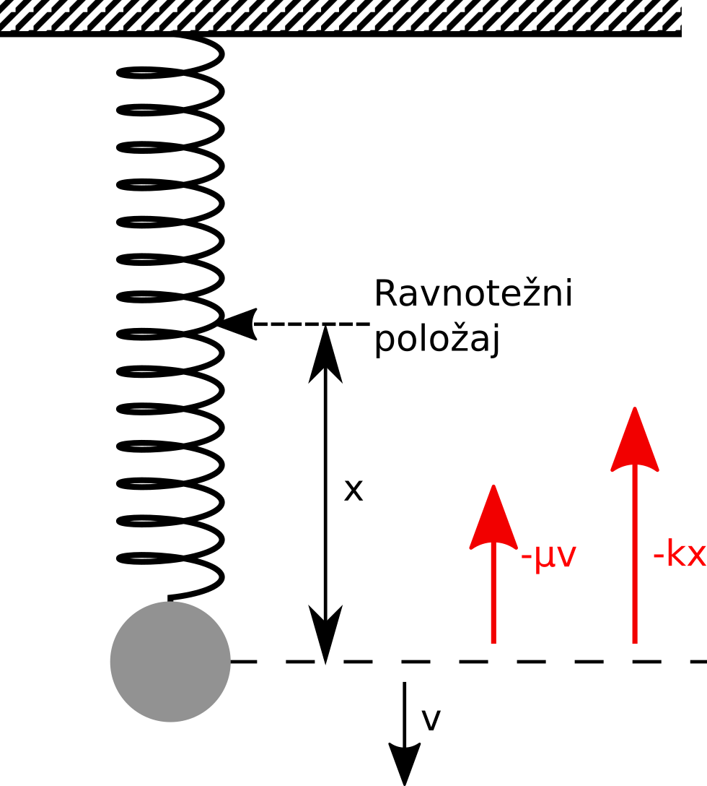
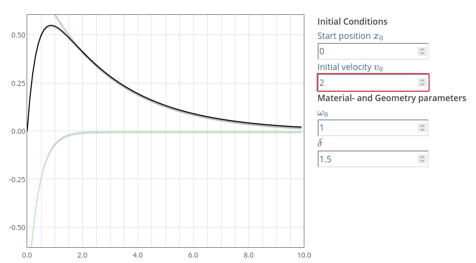
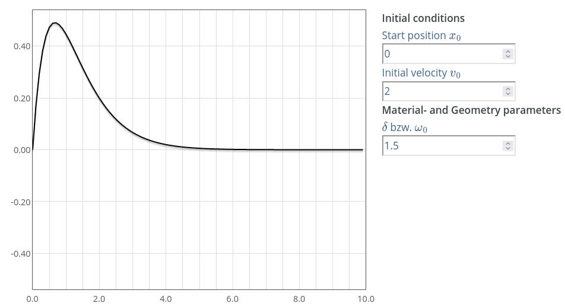
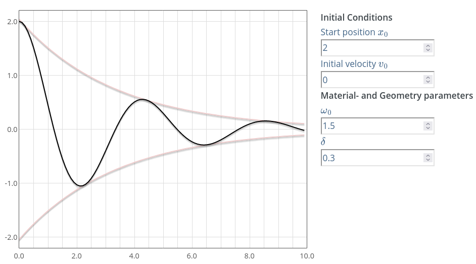

.. _oscilacije_uvod:

Осцилатор
===========================

Једно од најједноставнијих периодичних кретања у механици је осцилаторно кретање (осциловање), где се тело креће по истој путањи, али мења смер кретања. Ако бисмо разматрали осцилаторно кретање у идеалним условима, без трења и отпора средине, оно би трајало бесконачно. При таквим слободним, **непригушеним осцилацијама**, осцилатор не губи енергију, a амплитуда се не мења у току времена. Међутим, у реалним условима, мора да се узме у обзир утицај околине на кретање тела. Осциловање успорава са временом, смањују се амплитуде, јер се укупна механичка енергија троши на савладавање отпора средине. То су тзв. **пригушене  осцилације**, када осцилатор губи енергију и амплитуда се смањује у току времена. Трећи случај би био када губитак енергије осцилатора може да се надокнади деловањем спољашње периодичне силе. Амплитуда осциловања ће при оваквом начину кретања остати константна, ако се при сваком циклусу кретања у систем дода енергија једнака оној коју је систем изгубио. Овакво кретање се назива **принудно осциловање**. 

.. _opruga:

    Поставка експеримента са опругом и тегом. На тег делују сила еластичности опруге и сила трења.

Проблем који решавамо представља предвиђање осциловања тега који виси на опрузи, као што је приказано на . Параметри који утичу на кретање су маса тега, кеофицијент трења и коефицијент еластичности опруге. Силе које утичу на кретање осцилатора су:

* **Повратна сила опруге** :math:`F_f = k \cdot x` вуче тег ка тачки мировања и директно је пропорционална отклону клатна. Њен смер је супротан од смера отклона. Параметар *k* представља константу опруге.

* **Сила трења** :math:`F_r = -\mu \cdot \dot{x}` је пропорционална брзини тега, док је смер увек супротан смеру кретања. Параметар :math:`\mu` представља коефицијент трења.

Дакле, сила инерције је супротстављена двема силама:

.. math::
    m \ddot{x} = -\mu \dot{x} - k x

или трансформисано:

.. math::
    :label: eq:oscilacije-dif

    \ddot{x} + \frac{\mu}{m} \dot{x} + \frac{k}{m} x = 0

Ова једначина је линеарна хомогена диференцијална једначина другог реда са константним коефицијентима.  За аналитичко решавање диференцијалне једначине овог типа користи се експоненцијална функција облика:

.. math::
    x(t) = C e^{\lambda t}

Први и други извод ове једначине гласе:

.. math::
    :label: eq:izvodi

    \dot{x}(t) = \lambda C e^{\lambda t}, \qquad \ddot{x}(t) = \lambda^2 C e^{\lambda t}

Заменом једначина :math:numref:`eq:izvodi` у диференцијалну једначину :math:numref:`eq:oscilacije-dif` и скраћивањем добијамо:

.. math::
    :label: eq:karakteristicna

    \lambda^2 + \frac{\mu}{m} \lambda + \frac{k}{m} = 0

Ова једначина се назива **карактеристичном једначином**. Како је у питању квадратна једначина, разматрамо два решења:

.. math::
    \lambda_{1,2} = -\frac{\mu}{2m} \pm \sqrt{\left(\frac{\mu}{2m}\right)^2-\frac{k}{m}}.

Да бисмо додатно упростили израз, уводимо нове константе :math:`\delta` и :math:`\omega_0`:

.. math::
    \delta=\frac{\mu}{2m}, \qquad \omega_0=\sqrt{\frac{k}{m}}

па се решења карактеристичне једначине могу изразити у облику:

.. math::
    :label: eq:karakteristicna1

    \lambda_{1,2} = -\delta \pm \sqrt{\delta^2-\omega_0^2}.

У зависности од избора константи :math:`\delta` и :math:`\omega_0`, дискриминанта може бити: већа од нуле, мања од нуле или једнака нули. Стога :math:`\lambda_1` и :math:`\lambda_2` могу бити:

* Два реална различита решења 
* Два конјуговано комплексна решења 
* Два једнака реална решења 

Сваки од ових случајева захтева другачији приступ решавању. Уопштено решење хомогене једначине има облик:

.. math::
    :label: eq:opste

    x(t) = C_1 \cdot x_1(t) + C_2 \cdot x_2(t),

где фунцкије :math:`x_1(t)` и :math:`x_2(t)` зависе од вредности детерминанте у једначини :math:numref:`eq:karakteristicna1`. Сада ћемо размотрити све наведене случајеве. 

Препригушени случај
--------------------

Уколико је :math:`\delta > \omega_0`, онда доминира сила трења. Стога је дискриминанта у једначини :math:numref:`eq:karakteristicna1` позитивна и постоје два различита реална решења :math:`\lambda_1 \ne \lambda_2`:

.. math:: 
    x_1(t)=C_1 e^{\lambda_1 t}, \qquad x_2(t)=C_2 e^{\lambda_2 t}.

Заменом у једначину :math:numref:`eq:opste` добијамо опште решење диференцијалне једначине:

.. math:: 
    x(t) = C_1 e^{\left(-\delta+\sqrt{\delta^2-\omega_0^2}\right) t} + C_2 e^{\left(-\delta-\sqrt{\delta^2-\omega_0^2}\right) t}.

Услов који смо навели за препригушени случај налаже да је

.. math:: 
    \delta > \sqrt{\delta^2-\omega_0^2}

па је стога решење збир двеју ескпоненцијалних опадајућих функција. Како бисмо даље упростили израз, заменићемо корен новом константом:

.. math:: 
    \alpha = \sqrt{\delta^2-\omega_0^2}

па коначно решење за препригушени случај гласи:

.. math:: 
    x(t) = e^{-\delta t} \left(C_1 e^{\alpha t} + C_2 e^{-\alpha t}\right).

Интеграционе константе :math:`C_1` и :math:`C_2` можемо добити из почетних услова, тј. почетног положаја и почетне брзине тега:

.. math:: 
    x(0)=x_0, \quad \dot{x}(0)=v_0.

.. _prepriguseni:

    Промена положаја тега у току времена за препригушени случај осциловања. Добијено помоћу `симулатора <https://beltoforion.de/en/harmonic_oscillator/>`_.

На :numref:`prepriguseni` можемо видети графички приказ општег аналитичког решења за препригушени случај осцилатора. Овај дијаграм приказује кретање тега у времену. Црвена линија означава компоненту решења :math:`C_1 e^{\lambda_1 t}`, док зелена означава другу компоненту решења :math:`C_2 e^{\lambda_1 t}`. Црна линија је збир ова два парцијална решења и представља укупно решење диференцијалне једначине препригушеног случаја за задате почетне услове. 

Критично-пригушени случај
--------------------------

Овај случај се дешава када је :math:`\delta=\omega_0`.  У овом случају једначина :math:numref:`eq:karakteristicna1` има само једно решење

.. math:: 
    \lambda=\lambda_1=\lambda_2=-\delta

Две компоненте решења диференцијалне једначине су онда:

.. math:: 
    x_1(t)=C_1 e^{\lambda t}, \qquad x_2(t) = t C_2 e^{\lambda t}.

Заменом ових израза у опште решење :math:numref:`eq:opste` добијамо:

.. math:: 
    x(t) = e^{-\delta t} (C_1 + t C_2)

Интеграционе константе :math:`C_1` и :math:`C_2` можемо добити из почетних услова, тј. почетног положаја и почетне брзине тега.

.. _kriticno-priguseni:

    Промена положаја тега у току времена за критично пригушени случај осциловања.

На :numref:`kriticno-priguseni` видимо графички приказ општег решења критично пригушеног случаја. На дијаграму видимо кретање клатна током времена за задате почетне услове.

Подпригушени случај
--------------------------

Подпригушени случ наступа када је :math:`\delta < \omega_0`, тј. дискриминанта једначине :math:numref:`eq:karakteristicna1` је негативна. Стога су :math:`\lambda_1` и :math:`\lambda_2` комплексни бројеви. Експоненцијални израз

.. math::
    x(t) = C e^{\lambda t}

се поново користи за добијање компоненти решења ове диференцијалне једначине:

.. math:: 

    x_1(t)=C_1 e^{\lambda_1 t}, \qquad x_2(t) = C_2 e^{\lambda_2 t}.

Заменом у једначину :math:numref:`eq:opste` и заменом :math:`\lambda` добијамо следећи израз:

.. math:: 
    :label: eq:podpriguseni

    x(t) = e^{-\delta t} \left( C_1 e^{\sqrt{\delta^2-\omega_0^2} t} + C_2 e^{-\sqrt{\delta^2-\omega_0^2} t} \right).

Сада радимо са комплексним решењима зато што су поткорене вредности негативне. Стога константе :math:`C_1` и :math:`C_2` имају комплексне вредности. За рад са комплексним вредностима користимо ојлерову формулу:

.. math:: 
    e^{i\phi} = \cos\phi + i\sin\phi

Корисно би било да изменимо једначину тако што бисмо раздвојили имагинарне делове:

.. math:: 
    \sqrt{\delta^2-\omega_0^2} = \sqrt{-1 \cdot (\omega_0^2-\delta^2)} = i \sqrt{\omega_0^2-\delta^2}.

Добијамо део који се састоји од имагинарне вредности *i* помноженим кореном реалних вредности. Да бисмо упростили даља израчунавања, замењујемо корен новом константом 

.. math:: 
    \omega = \sqrt{\omega_0^2-\delta^2}

Ова константа представља **природну фреквенцију хармонијског осцилатора**. Тада једначина :math:numref:`eq:podpriguseni` може да се трансформише у:

.. math:: 
    x(t) = e^{-\delta t} \left( C_1 e^{i\omega t} + C_2 e^{-i\omega t} \right).

Са физичке стране, интересују нас само реалне вредности. Да бисмо их пронашли неопходно је да раздвојимо имагинарни и реални део. Као што је већ поменуто, 
константе  :math:`C_1` и :math:`C_2` су константе са комплексним вредностима, а њихов поларни облик је:

.. math:: 
    C_1 = \hat{C_1}e^{i\phi_1}, \qquad C_2 = \hat{C_2}e^{i\phi_2}

Како аналитичко решавање овог проблема није у фокусу овог материјала, нећемо до краја аналитички изводити решење, већ само навести крајње решење за подпригушени случај, након одабира реалних решења и трансформације и оддабира одговарајућих константи:

.. math:: 
    x(t) = e^{-\delta t} (2A\cos(\phi+\omega t))

:math:`A`` је амплитуда, а :math:`\phi` је фазни померај. Константе се могу добити из почетних услова, као што су:

.. math:: 
    x(0)=x_0, \quad \dot{x}(0)=v_0.

Овим смо извели сва потребна аналитичка решења са којима ћемо поредити решење добијено помоћу ФЗНН приступа.

.. _podpriguseni:

    Промена положаја тега у току времена за критично podпригушени случај осциловања.

