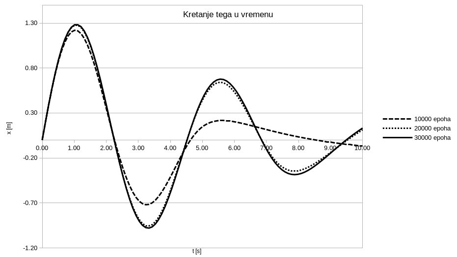
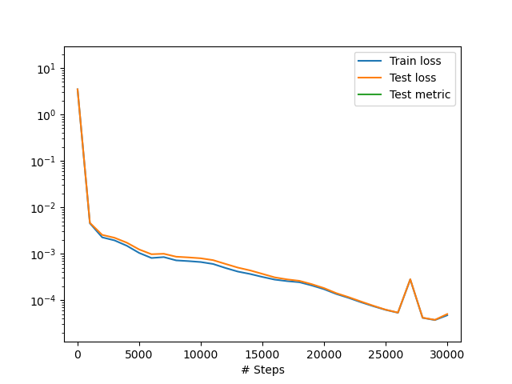
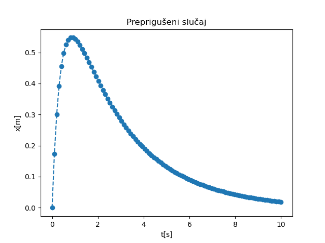
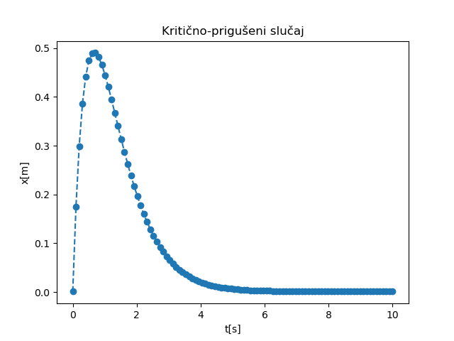

.. _oscilacije_rezultati:

Решења директног проблема
===============================

Сада ћемо се позабавити резултатима процеса учења који смо успоставили у претходној секцији :ref:`oscilacije_implementacija`. 

Подпригушени случај
----------------------

За случај да је:

.. math:: 
    m = 1 \\
    \mu = 0,1 \\
    k = 2

имамо да су:

.. math:: 
    \delta = \frac{\mu}{2m} = 0,05 \\
    \omega_0 = \sqrt{\frac{k}{m}} = \sqrt{2}

Како је :math:`\delta^2-\omega_0^2 < 0`, имаћемо два конјуговано-комплексна решења, тј. подпригушени случај описан у секцији :ref:`sekcija_podpriguseni`. Решења добијена скриптом датом у :ref:`oscilacije_implementacija` где су почетни услови постављени тако да је :math:`(x_0=0, v_0=2)` приказана су на :numref:`podpriguseni-rezultati`.

.. _podpriguseni-rezultati:

    ФЗНН решење промене положаја тега у току времена за подпригушени случај осциловања.

На графику се може видети како се резултати разликују у односу на то колико епоха је мрежа тренирана. Наиме, резултати за 10000 епоха су значајно лошији него они за 20000 и 30000 епоха. Дакле, као и код готово свих проблема дубоког учења и код ФЗНН тај процес треба пратити (:numref:`podpriguseni-rezultati-loss`) и тренинг прекинути тек када је досегнут одговарајући минимум и учење даље не напредује значајно. 

.. _podpriguseni-rezultati-loss:

    Функција губитка у току процеса учења.

Препригушени случај
----------------------

Уколико је, на пример:

.. math:: 
    m = 1 \\
    \mu = 3 \\
    k = 1

имамо да су:

.. math:: 
    \delta = \frac{\mu}{2m} = 1,5 \\
    \omega_0 = \sqrt{\frac{k}{m}} = 1

Како је :math:`\delta^2-\omega_0^2 > 0`, имаћемо два различита реална решења, тј. препригушени случај описан у секцији :ref:`sekcija_prepriguseni`. Решења добијена скриптом датом у :ref:`oscilacije_implementacija` за почетне услове :math:`(x_0=0, v_0=2)` приказана су на :numref:`prepriguseni-rezultati`.

.. _prepriguseni-rezultati:

    ФЗНН решење промене положаја тега у току времена за препригушени случај осциловања.

Критично-пригушени случај
---------------------------

Преостао је још критично-пригушени случај који ће се добити уколико поставимо следеће параметре проблема:

.. math:: 
    m = 1 \\
    \mu = 3 \\
    k = 2,25

имамо да су:

.. math:: 
    \delta = \frac{\mu}{2m} = 1,5 \\
    \omega_0 = \sqrt{\frac{k}{m}} = 1,5

Како је :math:`\delta^2-\omega_0^2 = 0`, имаћемо два једнака реална решења, тј. критично-пригушени случај описан у секцији :ref:`sekcija_kriticnopriguseni`. Решења добијена скриптом датом у :ref:`oscilacije_implementacija` за почетне услове :math:`(x_0=0, v_0=2)` приказана су на :numref:`kriticnopriguseni-rezultati`.

.. _kriticnopriguseni-rezultati:

    ФЗНН решење промене положаја тега у току времена за критично-пригушени случај осциловања.

