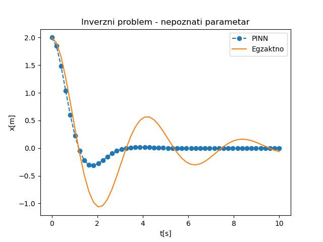
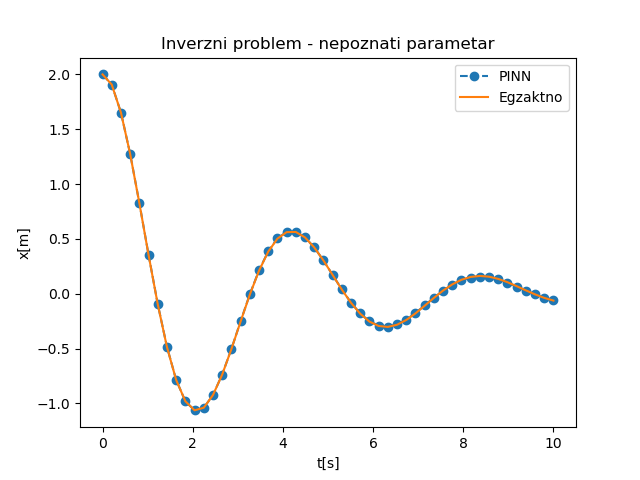

.. _oscilacije_inverzni:

Инверзни проблем
==================

Као што смо већ у више наврата нагласили, права снага ФПНМ долази до изражаја код проблема у којима је потребно идентификовати непознате параметре. Разлог томе је што ФПНМ метода инверзне проблеме третира на исти начин као директне. Важно је само да се проблем постави не дозвољавајући вишезначност, што ћемо демонстрирати на следећем примеру. Замислимо експеримент постављен као на :numref:`opruga` у коме нам је познат само коефицијент трења :math:`\mu=0,6`, а не знамо ни масу куглице :math:`m` ни коефицијент еластичности опруге :math:`k`. Задатак нам је да идентификујемо ова два параметра тако што ћемо пустити куглицу да осцилује и на основу њеног кретања дати ФПНМ да одреди елементе који недостају.

Рецимо да смо визуелно утврдили да је у питању **подпригушени случај**. Прва стратегија мерења која би могла да буде реално изводљива је да куглицу отклонимо за :math:`x_0=2` и само пустимо (:math:`v_0=0`), а онда штоперицом одредимо временске тренутке у којима куглица пролази кроз равнотежни положај и да те тренутке забележимо:

+--------+-------+-------+-------+-------+-------+
| **t**  | 1,18  | 3,27  | 5,37  | 7,46  | 9,55  |
+--------+-------+-------+-------+-------+-------+
| **x**  | 0     | 0     | 0     | 0     | 0     |
+--------+-------+-------+-------+-------+-------+

Дакле, поред граничних и почетних услова :math:`(x_0=2,v_0=0)` увешћемо и граничне услове типа ``PointSet`` који дефинишу вредност моделоване функције у појединим тачкама. Програмски код који имплементира овај инверзни проблем дат је на следећем листингу.

.. code-block:: python
    :caption: Инверзни проблем пригушених осцилација у 1Д. Непознати параметри су ``m`` и ``k``.
    :linenos:

    import deepxde as dde
    from deepxde.backend import tf
    import numpy as np
    import matplotlib.pyplot as plt

    m = dde.Variable(0.5)
    mu = 0.6
    k = dde.Variable(2.)

    x0, v0 = 2, 0

    delta = mu / (2*m)
    w0 = tf.sqrt(k/m)

    # Da li je tacka blizu t=0 (provera pocetnog uslova)
    def boundary_l(t, on_initial):
        return on_initial and np.isclose(t[0], 0)

    # Jednacina ODE
    def Ode(t,x):
            dxdt = dde.grad.jacobian(x,t)
            dxdtt = dde.grad.hessian(x,t)
            return m * dxdtt + mu * dxdt + k*x
        
    # x(0)=x0
    def bc_func1(inputs, outputs, X):
        return outputs - x0

    # x'(0)=v0
    def bc_func2(inputs, outputs, X):
        return dde.grad.jacobian(outputs, inputs, i=0,j=None) - v0
        
    # Resava se na domenu t=(0,10)
    interval = dde.geometry.TimeDomain(0, 10)

    # Pocetni uslovi
    ic1 = dde.icbc.OperatorBC(interval, bc_func1, boundary_l)
    ic2 = dde.icbc.OperatorBC(interval, bc_func2, boundary_l)

    bc_x = np.array([1.18, 3.27, 5.37, 7.46, 9.55]).reshape(6,1)
    bc_y = np.array([0, 0, 0, 0, 0 ]).reshape(6,1)
    ic3 = dde.icbc.PointSetBC(bc_x, bc_y, component=0)

    # Definsanje problema, granicnih uslova, broja kolokacionih tacaka
    data = dde.data.TimePDE(interval, Ode, [ic1, ic2, ic3], 200, 20, solution=func, num_test=100)
        
    layers = [1] + [30] * 3 + [1]
    activation = "tanh"
    init = "Glorot uniform"
    net = dde.nn.FNN(layers, activation, init)

    model = dde.Model(data, net)

    # Callback funkcija koja stampa varijablu na svakih 1000 epoha
    variable1 = dde.callbacks.VariableValue(k, period=1000)
    variable2 = dde.callbacks.VariableValue(m, period=1000)

    model.compile("adam", lr=.001, loss_weights=[0.01, 1, 1, 1], metrics=["l2 relative error"], external_trainable_variables=[k,m])
    losshistory, train_state = model.train(epochs=50000, callbacks=[variable1, variable2])

Објаснићемо само делове који се разликују у односу на директни проблем решен у секцији :ref:`oscilacije_implementacija`. За почетак, ту су непознати параметри које декларишемо на следећи начин:

.. code-block:: python

    m = dde.Variable(0.5)
    k = dde.Variable(2.)

У загради се дају почетне вредности параметра. Следеће линије дефинишу поменути додатни ``PointSet`` гранични услов (услове) који важе у појединим тачкама *унутар домена*:

.. code-block:: python

    bc_x = np.array([1.18, 3.27, 5.37, 7.46, 9.55]).reshape(6,1)
    bc_y = np.array([0, 0, 0, 0, 0 ]).reshape(6,1)
    ic3 = dde.icbc.PointSetBC(bc_x, bc_y, component=0)

Како бисмо обезбедили праћење вредности непознатих параметара током обуке, потребно је да поставимо тзв. ``callback`` функције, које ће се позивати на сваких 1000 епоха:

.. code-block:: python

    variable1 = dde.callbacks.VariableValue(k, period=1000)
    variable2 = dde.callbacks.VariableValue(m, period=1000)

Приликом постављања модела постављамо екстерне варијабле за тренирање ``k`` и ``m``, док се при позиву тренинга наводе ``callback`` функције:

.. code-block:: python

    model.compile("adam", lr=.001, loss_weights=[0.01, 1, 1, 1], metrics=["l2 relative error"], external_trainable_variables=[k,m])
    losshistory, train_state = model.train(epochs=50000, callbacks=[variable1, variable2])

Након завршеног обучавања, добија се, очигледно погрешно, решење које је приказано на :numref:`inverzni-pogresno`. У односу на аналитичко решење које је постављено користећи вредности параметара ``m=1`` и ``k=2,25``, добијене вредности ``m=0,287`` и ``k=1,22`` се пуно разликују.

.. _inverzni-pogresno:

    ФПНМ решење инверзног проблема са непознатим параметрима. Пронађене вредности су ``m=0,287`` и ``k=1,22``. 

Зашто смо добили овако лоше решење? Одговор се крије у лоше постављеним граничним условима који доводе до неједнозначности инверзног проблема. Наиме, постоји више сценарија, тј. парова ``(m,k)`` који задовољавају граничне услове постављене само у тачкама проласка тега кроз равнотежни положај. Очигледно је да морамо да додамо још неку тачку ван равнотежног положаја, како бисмо обезбедили једнозначно решење. Замислимо да смо измерили и тренутак када је тег био на највећој негативној удаљености у односу на равнотежни положај и колика је та удаљеност била. Додајмо сада и ту тачку у постављени ``PointSet``, који сада изгледа овако:

+--------+-------+-------+-------+-------+-------+-------+
| **t**  | 1,18  | 3,27  | 5,37  | 7,46  | 9,55  | 2,12  |
+--------+-------+-------+-------+-------+-------+-------+
| **x**  | 0     | 0     | 0     | 0     | 0     |-1,67  |
+--------+-------+-------+-------+-------+-------+-------+

Погледом на :numref:`inverzni-ispravno` одмах се види да је поклапање са аналитичким решењем у овако постављеном проблему скоро па идеално.

.. _inverzni-ispravno:

    ФПНМ решење инверзног проблема са непознатим параметрима. Пронађене вредности су ``m=0,98`` и ``k=2,26``. 

Исправност решења додатно потврђују параметри ``m=0,98`` и ``k=2,26``, чије су вредности веома блиске онима које су дате у аналитичкој поставци ``m=1`` и ``k=2,25``. На овај начин смо показали да приступ решавању инверзног проблема, иако методолошки сличан, има специфичности о којима треба водити рачуна. Код директних проблема решење је увек једнозначно, док код инверзних морају да се обезбеде одговарајући услови који у довољној мери детерминишу решење. 
