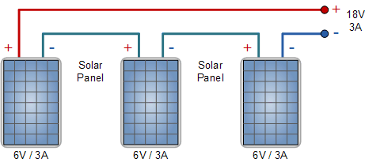
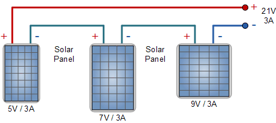
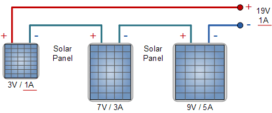
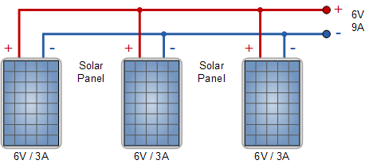
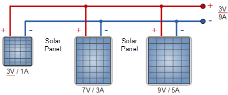

.. _solari_uvod:

Увод
=========

У овом поглављу бавићемо се једним врло практичним проблемом, који је аутору и сарадницима и и послужио као један од основних мотива за рад са ФЗНМ. Наиме, ради се о "вечитом јазу" између резултата које даје неки модел и стварних мерења. Како овај јаз смањити, тј. како помирити модел и стварне податке? Примера ради, соларне електране су прилично добро покривене различитим физичким моделима који дају одличне резултате, али **само ако су сви улазни параметри и параметри самог система познати**, што углавном није случај. Међутим, подаци о времену као што су температура, компоненте сунчевог зрачења и брзина ветра нису сасвим прецизни. Ту је и фактор старења самих панела који умањује њихову ефикасност, могућа прекривеност снегом и прашином и разни други фактори који реално утичу на производњу. 

Са друге стране, било који соларни систем новије производње нуди инстант мерење излазне снаге наизменичне струје на излазу из инвертера. Покушаћемо да одговоримо на питање да ли је могуће ове мерене податке "вратити" у модел, тј. њиховим коришћењем побољшати предвиђање модела у будућности. Додатно треба нагласити да модел соларног система који ћемо демонстрирати :cite:t:`dobos2014pvwatts` и није заснован на обичној или парцијалној диференцијалној једначини, већ на једноставном аналитичком изразу. Строго гледано, могуће је искористити и обичну дубоку неуронску мрежу да опише понашање такве једначине и мануелно формирати и функцију губитка која ће испоштовати и једначину и мерене податке. Међутим, ФЗНМ библиотека као што је DeepXDE пружа добар софтверски оквир који у доброј мери олакшава рад са проблемима који су засновани на аналитички израженим законима. 

У наставку ћемо објаснити основе на којима функционишу соларне електране, укључујући улазне варијабле, као и начин функционисања и карактеристике самог уређаја. 

Компоненте зрачења
----------------------

Kоличина сунчеве енергије прикупљена од стране соларног панела између осталог зависи од **његове оријентације**. На пример, соларни панел окренут ка западу ће прикупљати малу количину сунчеве енергије током јутра зато што је оријентисан ка тамнијем делу неба. Са померањем сунца, соларни панел се све више обасјава, па сакупља веће количине зрачења. Ово је кључ *Plane of Array* (POA) концепта који подразумева количину сунчеве светлости која се може прикупити за задати положај панела. Локација, нагнутост и оријентација панела су од кључног значаја за процену количине енергије која на панел пада. Осунчаност се мери у ватима по квадратном метру :math:`\frac{W}{m^2}`. 

.. _komponente:

.. figure:: tutorial-1-dnidhighi.png
    :width: 80%

    Илустрација директног и дифузног сунчевог зрачења

Kада се моделује озраченсот равни панела, из практичних разлога, посматрају се следеће три компоненте: 

- ``GHI`` – **Глобална хоризонтална озраченост**, тј. укупна јачина сунчеве светлости која пада на хоризонталну раван, :numref:`ghi`. 
- ``DHI`` – **Дифузна хоризонтална озраченост**, део сунчеве светлости која пада на хоризонталну раван али која не долази директно од Сунца, :numref:`dhi`. 
- ``DNI`` – **Директна нормална озраченост**, тј. део сунчеве светлости која долази директно од Сунца, :numref:`dni`. 

Свака од наведених компоненти се одговарајућим мерним поступком и инструментом посебно мери.  На пример, израчунавање компоненте директног зрачења (``DNI``) која пада на панел решава се једноставно на основу упадног угла. Проналажење компоненте дифузне озрачености ``DHI`` је сложеније и може варирати у зависности од атмосферских услова. У употреби су многи модели чија је улога конверзија ``DHI`` у дифузну компоненту. Трећа компонента зрачења (``GHI``) је светлост која се одбија од тла пре него што је сакупи фотонапонска плоча. На Интернету се могу пронаћи базе историјских података. На појединим плаћеним сервисима могу се наћи и прогнозе. Серије на овим сервисима су углавном сатне. 

.. _ghi:

.. figure:: t1-ghi.png
    :width: 60%

    ``GHI``- Глобална хоризонтална озраченост

.. _dhi:

.. figure:: t1-dhi.png
    :width: 60%

    ``DHI`` – Дифузна хоризонтална озраченост

.. _dni:

.. figure:: t1-dni.png
    :width: 60%

    ``DNI`` – Директна нормална озраченост

Оријентација и локација панела
--------------------------------

Два су кључна угла који дефинишу оријентацију соларног панела. Један одређује правац постављања панела (север, истог, југ, запад), а други одређује нагнутост соларног панела у односу на хоризонталну раван. ``Azimuth`` одређује правац постављања панела при чему договорно важи да је север 0, исток 90, југ 180, а запад 270 степени. ``Tilt`` који одређује нагнутост соларног панела има вредност 0 ако је панел постављен хоризонтално, а вредност 90 уколико је постављен потпуно вертикално. У зависности од начина постављања система тилт и азимутх могу бити фиксне вредности или временске серије. На таквим системима обично ``tilt`` може да се мења, пративши кретање сунца на небу и обезбеђујући већу озраченост нормалном компонентом зрачења. 

Одређивање тачне **локације панела** је веома важно приликом рачунања угла који Сунце заклапа са панелом у различито доба године. Параметри за рачунање угла који сунце заклапа са панелом су: 

- географска ширина, 
- географска дужина, 
- надморска висина и  
- временска зона. 

Начини повезивања панела
-------------------------------------

Соларни панели се у електрично коло могу редно (серијски) и паралелно. Редна веза сумира напон у електричном колу, док паралелна веза повећава јачину струје. Могуће је направити и комбинацију редне и паралелне везе. 

.. _serijska-isti:

    **Серијска веза соларних панела истих карактеристика**. Сви соларни панели су истог типа и имају исту излазну снагу. Укупан напон електричног кола је збир напона на сваком панелу. У овом примеру имамо 3 панела који производе напон од 6V и струју јачине 3A, односно електрично коло има напон од 18V и струју јачине 3A. Укупна снага везе је :math:`18V \cdot 3А = 54W` при `максималној осунчаности <https://www.alternative-energy-tutorials.com/solar-power/connecting-solar-panels-together.html>`_. 

.. _serijska-razliciti:

    **Серијска веза соларних панела различитих волтажа**. У овом примеру сви соларни панели су различитих типова, имају различиту снагу, али им је заједничка максимална јачина струје. Kада су везани серијски, заједно производе електрични напон од 21V и струју јачине 3А, односно снага је 63W. Јачинаструје је иста као и у претходном примеру, али је промењен напон (5V+7V+9V).

.. _serijska-razliciti-IV:

    **Серијска веза панела различитих напона и јачина електричне струје**. У овој методи соларни панели су различитих типова, сваки панел има различит напон, јачину струје и снагу. Укупни напон електричног кола поново се рачуна као збир напона на сваком соларном панелу (3V+7V+9V), док је јачина струја у колу ограничена панелом с најмањом јачином струје - 1A. Тиме је снага лимитирана на само 19W од могућих 69W. Употреба соларних панела различитих струја није ефикасна у редној вези. 

.. _paralelna-isti:

    **Паралелна веза соларних панела истих карактеристика**. Сви соларни панели на слици имају исте карактеристике, напон, јачину електричне струје и снагу. Напон на сваком панелу је 6V па је и укупан напон кола 6V. Јачина струје на излазу представља збир свих јачина електричне струје на панелима 3A+3A+3A=9A. Остварена снага при потпуној осунчаности панела износи 54W.

.. _paralelna-razliciti:

    
    **Паралелна веза соларних панела различитих напона и јачина струје**. Да би радили у паралелиној вези, сви соларни панели морају имати исти напон, односно напон на свим панелима биће једнак најмањем напону на једном од панела. Дакле, укупан напон кола износи 3V, док је укупна јачина електричне струје одређена збиром струја 1A+3A+5A=9A. Снага износи само 27W. Због ових губитака не препоручује се паралелна веза соларних панела различитих напона.

Номинална снага панела (*Peak Power (kWp)*)
----------------------------------------------

Мерења снаге соларних панела у лабораторији или фабрици врши се под стандардизованим условимa. Ти услови дефинисани су интеграционим стандардном IEC-60904-1 и то су: 

- Интензитет осунчаности износи :math:`1000W/m^2` на целој површини соларног панела. Представља слабу осунчаност и у реалним условима ова вредност може бити већа. 
- Температура панела износи 25℃. Спектар светлости мора бити исти као глобални спектар светлост дат у IEC 60904-3. То одговара спектру светлости по сунчаном дану са положајем сунца око 40° изнад хоризонта и панелом који је окренут према сунцу, а са хоризонтом заклапа угао од 40°.
 
Измерена снага при овим условима назива се номинална снага или снага у пику – *Peak Power*. Номинална снага изражава се у киловат-пику *kWp*. Ако није позната укупна декларисана номинална снага соларних панела, а познати су површина соларних панела :math:`m^2` и декларисана ефикасност у %, може се израчунати по формули: 

.. math::
    NominalnaSnaga = 1\frac{kW}{m^2} \cdot Povrsina \cdot \frac{Efikasnost}{100}
 
У већини случајева номинална снага је позната и дата је у спецификацији производа од стране произвођача. Номинална снага још се назива и максимална снага и означава са :math:`P_{max}`.
