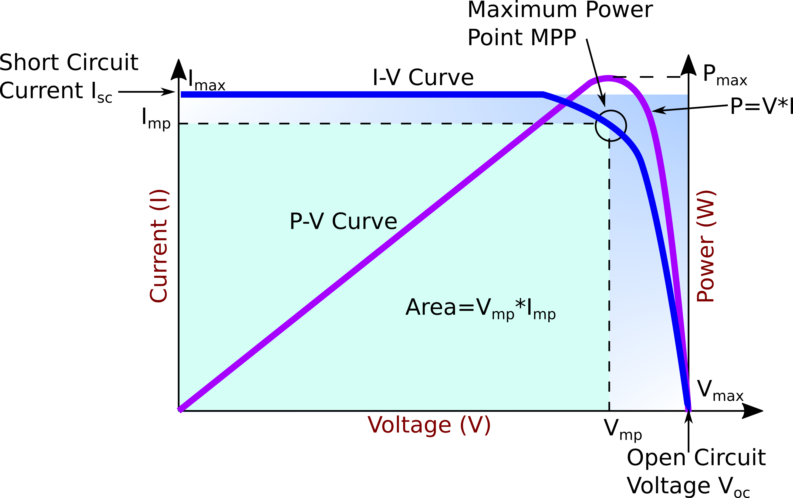

.. _solari_uvod:

Увод
=========

У овом поглављу бавићемо се једним врло практичним проблемом, који је аутору и сарадницима и послужио као један од основних мотива за рад са НМПФЗ. Наиме, ради се о "вечитом јазу" између резултата које даје модел и стварних мерења. Како овај јаз смањити, тј. како помирити модел и стварне податке? Примера ради, соларне електране су прилично добро покривене различитим физичким моделима који дају одличне резултате, али **само ако су сви улазни параметри и параметри самог система познати**, што углавном није случај. Прво, подаци о времену као што су температура, компоненте сунчевог зрачења и брзина ветра нису сасвим прецизни. Ту је и фактор старења самих панела који умањује њихову ефикасност, могућа прекривеност снегом и прашином и разни други фактори који реално утичу на производњу. 

Са друге стране, било који соларни систем новије производње нуди инстант мерење излазне снаге наизменичне струје на излазу из инвертера. Покушаћемо да одговоримо на питање да ли је могуће ове мерене податке "вратити" у модел, тј. њиховим коришћењем побољшати предвиђање модела у будућности. Додатно треба нагласити да модел соларног система који ћемо демонстрирати :cite:t:`dobos2014pvwatts` и није заснован на обичној или парцијалној диференцијалној једначини, већ на једноставном аналитичком изразу. Строго гледано, могуће је искористити и обичну дубоку неуронску мрежу да опише понашање такве једначине и мануелно формирати и функцију губитка која ће испоштовати и једначину и мерене податке. Међутим, НМПФЗ библиотека као што је DeepXDE пружа добар софтверски оквир који у великој мери олакшава рад са оваквим проблемима. 

У наставку ћемо објаснити основе на којима функционишу соларне електране, укључујући значајне улазне варијабле, начин функционисања и карактеристике самих уређаја. 

.. _solari_komponente:

Компоненте зрачења
----------------------

Количина сунчеве енергије прикупљена од стране соларног панела између осталог зависи од **његове оријентације**. На пример, соларни панел окренут ка западу ће прикупљати малу количину сунчеве енергије током јутра јер је оријентисан ка тамнијем делу неба. Са померањем сунца, соларни панел се све више обасјава, па сакупља веће количине зрачења. Ово је кључ *Plane of Array* (POA) концепта који подразумева количину сунчеве светлости која се може прикупити за задати положај панела. Локација, нагнутост и оријентација панела су од кључног значаја за процену количине енергије која на панел пада. Осунчаност се изражава у ватима по квадратном метру :math:`\frac{W}{m^2}`. 

.. _komponente:

    Илустрација директног и дифузног сунчевог зрачења

Када се моделује озраченост равни панела, из практичних разлога, посматрају се следеће три компоненте: 

- ``GHI`` – **Глобална хоризонтална озраченост**, укупна јачина сунчеве светлости која пада на хоризонталну раван, :numref:`ghi`. 
- ``DHI`` – **Дифузна хоризонтална озраченост**, део сунчеве светлости која пада на хоризонталну раван, али која не долази директно од сунца, :numref:`dhi`. 
- ``DNI`` – **Директна нормална озраченост**, део сунчеве светлости која долази директно од сунца, :numref:`dni`. 

Свака од наведених компоненти се одговарајућим мерним поступком и инструментом посебно мери. На пример, израчунавање компоненте директног зрачења ``DNI`` која пада на панел решава се једноставно на основу упадног угла. Проналажење компоненте дифузне озрачености ``DHI`` је сложеније и може варирати у зависности од атмосферских услова. У употреби су различити приступи за конверзију ``DHI`` у дифузну компоненту. Трећа компонента зрачења ``GHI`` је светлост која се одбија од тла пре него што је сакупи фото-напонска плоча. На Интернету се могу пронаћи бесплатне базе историјских података. На појединим плаћеним сервисима могу се наћи и прогнозе све три компоненте. Серије на овим сервисима су углавном сатне учестаности. 

.. _ghi:

    ``GHI``- Глобална хоризонтална озраченост

.. _dhi:

.. figure:: t1-dhi.png
    :width: 50%

    ``DHI`` – Дифузна хоризонтална озраченост

.. _dni:

    ``DNI`` – Директна нормална озраченост

Оријентација и локација панела
--------------------------------

Два су кључна угла који дефинишу оријентацију соларног панела. Један одређује правац постављања панела (север, истог, југ, запад), а други одређује нагнутост соларног панела у односу на хоризонталну раван. ``Azimuth`` одређује правац постављања панела, при чему договорно важи да је север 0, исток 90, југ 180, а запад 270 степени. ``Tilt`` који одређује нагнутост соларног панела има вредност 0 ако је панел постављен хоризонтално, а вредност 90 уколико је постављен потпуно вертикално. У зависности од начина постављања система, и један и други угао могу бити фиксне вредности или временске серије. На таквим системима се обично ``tilt`` мења, пратећи кретање сунца на небу и обезбеђујући већу озраченост нормалном компонентом. 

.. tilt-azimuth:

.. figure:: Tilt-vs-Azimuth.jpg
    :width: 60%

    Оријентација соларног панела

Одређивање тачне **локације панела** је веома важно приликом рачунања угла који Сунце заклапа са панелом у различито доба године. Параметри за рачунање угла који сунце заклапа са панелом су: 

- географска ширина, 
- географска дужина, 
- надморска висина и  
- временска зона. 

Начини повезивања панела
-------------------------------------

Соларни панели се у електрично коло могу редно (серијски) и паралелно. Редна веза сумира напон у електричном колу, док паралелна веза повећава јачину струје. Могуће је направити и комбинацију редне и паралелне везе. 

.. _serijska-isti:

    **Серијска веза соларних панела истих карактеристика**. Сви соларни панели су истог типа и имају исту излазну снагу. Укупан напон електричног кола је збир напона на сваком панелу. У овом примеру имамо 3 панела који производе напон од 6V и струју јачине 3A, односно електрично коло има напон од 18V и струју јачине 3A. Укупна снага везе је :math:`18V \cdot 3A = 54W` при `максималној осунчаности <https://www.alternative-energy-tutorials.com/solar-power/connecting-solar-panels-together.html>`_. 

.. _serijska-razliciti:

    **Серијска веза соларних панела различитих волтажа**. У овом примеру сви соларни панели су различитих типова, имају различиту снагу, али им је заједничка максимална јачина струје. Када су везани серијски, заједно производе електрични напон од 21V и струју јачине 3А, односно снага је 63W. Јачина струје је иста као и у претходном примеру, али је промењен напон (5V+7V+9V).

.. _serijska-razliciti-IV:

.. figure:: alt107.png
    :width: 60%

    **Серијска веза панела различитих напона и јачина електричне струје**. У овој методи соларни панели су различитих типова, сваки панел има различит напон, јачину струје и снагу. Укупни напон електричног кола поново се рачуна као збир напона на сваком соларном панелу (3V+7V+9V), док је јачина струја у колу ограничена панелом с најмањом јачином струје - 1A. Тиме је снага лимитирана на само 19W од могућих 69W. Употреба соларних панела различитих струја није ефикасна у редној вези. 

.. _paralelna-isti:

.. figure:: alt112.png
    :width: 60%

    **Паралелна веза соларних панела истих карактеристика**. Сви соларни панели на слици имају исте карактеристике, напон, јачину електричне струје и снагу. Напон на сваком панелу је 6V па је и укупан напон кола 6V. Јачина струје на излазу представља збир свих јачина електричне струје на панелима 3A+3A+3A=9A. Остварена снага при потпуној осунчаности панела износи 54W.

.. _paralelna-razliciti:

.. figure:: alt113.png
    :width: 60%
    
    **Паралелна веза соларних панела различитих напона и јачина струје**. Да би радили у паралелној вези, сви соларни панели морају имати исти напон, односно напон на свим панелима биће једнак најмањем напону на једном од панела. Дакле, укупан напон кола износи 3V, док је укупна јачина електричне струје одређена збиром струја 1A+3A+5A=9A. Снага износи само 27W. Због ових губитака не препоручује се паралелна веза соларних панела различитих напона.

Номинална снага панела (*Peak Power - kWp*)
----------------------------------------------

Мерења снаге соларних панела у лабораторији или фабрици врши се под стандардизованим условима. Ти услови дефинисани су интеграционим стандардном IEC-60904-1 и то су: 

- Интензитет осунчаности износи :math:`1000W/m^2` на целој површини соларног панела. У реалним условима ова вредност је неретко већа. 
- Температура панела износи 25°C. Спектар светлости мора бити исти као глобални спектар светлости дефинисан у IEC 60904-3. Одговара спектру светлости по сунчаном дану са положајем сунца око 40° изнад хоризонта и панелом који је окренут према сунцу, а са хоризонтом заклапа угао од 40°.
 
Измерена снага при овим условима назива се номинална снага или снага у пику – *Peak Power*. Номинална снага изражава се у киловат-пику *kWp*. Ако није позната укупна декларисана номинална снага соларних панела, а познати су површина соларних панела :math:`m^2` и декларисана ефикасност у %, може се израчунати по формули: 

.. math::
    NominalnaSnaga = 1\frac{kW}{m^2} \cdot Povrsina \cdot \frac{Efikasnost}{100}
 
У већини случајева номинална снага је позната и дата је у спецификацији производа од стране произвођача. Номинална снага још се назива и максимална снага и означава са :math:`P_{max}`.

Инвертер
------------------

Соларним панелима производи се једносмерна струја (DC). Да би се употребила произведена електрична енергија, потребно је извршити DC/AC конверзију. У употреби су различити типови инвертера: 

- *Grid-tie inverter* - Прикључени су на дистрибутивну електричну мрежу, односно произведена електрична енергија прослеђује се дистрибутивној електричној мрежи. За њихов рад није потребна батерија. 

- *Off-grid inverter* – Познати су и као независни инвертери. Конвертују једносмерну струју из батерија у наизменичну. Углавном се користе за више домаћинства, или стамбену зграду. 

- *Hybrid inverter* – Конвертују DC у AC и могу се користити и као *off-grid* и као *grid-tie* системи. 

- *String inverter* – Најчешће се користе у домаћинствима. Називају се "стринг" јер се на њих прикључује низ соларних панела. Може се прикључити и више низова одједном.  

Сваки инвертер има дефинисану максималну снагу. То је важно из два разлога: (1) електронске компоненте инвертера дизајниране су за рад са одређеним опсегом напона и (2) и сами соларни панели су дизајнирани за рад до одређене снаге. 

Инвертери, наравно, не могу пружити већу излазну снагу од прописане. Када се на улаз инвертера доводи једносмерна струја снаге веће од прописане улазне снаге појављује се одсецање инвертера, тј. инвертер има исту излазну снагу и поред повећања снаге на улазу. Инвертер може мењати напон на улазу како би смањио снагу на улазу. Повећава оперативни напон соларних панела преко њиховог дефинисаног максимума, чиме се смањује јачина произведене струје, односно умањује се снага на улазу инвертера. 

Размотримо ситуацију где су упарени соларни панели снаге 6 kW са DC/AC инвертером снаге 5 kW. На први поглед изгледа да ће доста снаге бити изгубљено, али велики број произвођача препоручују управо овакав однос. Овде уводимо појам односа снага DC и AC познат и као *Inverter Load Ratio* - ILR.  У овом примеру тај однос износи 1,2 (6kW/5kW).  Пројектанти оваквих система су генерално конзервативни по питању DC/AC односа. Већина сматра да је однос 1,1 идеалан, а 1,2 прејак. Ипак, однос 1,2 доводи до најмањих губитака, док 1,25 или 1,3 могу остварити одређене економске бенефите при куповини, јер се користе `јефтинији инвертери <https://help.helioscope.com/article/248-understanding-dc-ac-ratio>`_. 

I-V карактеристика соларне ћелије
-------------------------------------

Крива I-V карактеристике приказује однос струје и напона соларне ћелије, соларног панела или низа панела. Детаљно описује ефикасност конверзије соларне енергије у електричну. Познавање електричне I-V карактеристике и номиналне снаге :math:`P_{max}` панела је кључно за одређивање ефикасности.

Интензитет зрачења којим се обасјава соларна ћелија одређује интензитет струје, док **повећање температуре соларне ћелије смањује напон**. Крива I-V карактеристике је графичка репрезентација операција у соларној ћелији или панелу сумирајући однос између струје и напона, односно осунчаности и температуре. Крива пружа потребне информације за конфигурацију соларног панела, како би се конфигурисао за рад близу своје оптималне снаге (*Peak Power*). 

.. _iv-kriva:

    Карактеристична I-V крива
    
На :numref:`iv-kriva` види се I-V карактеристика (плава линија) типичне силиконске соларне ћелије при нормалним условима. Снага испоручена од стране једне соларне ћелије или панела је производ излазне струје и напона. Крива снаге у зависности од напона означена је љубичастом бојом. Соларна ћелија је **пасивни уређај у електричном колу**. I-V крива приказује све могућности за рад соларне ћелије, али стварни однос струје и напона зависиће од додатног оптерећења у електричном колу.

На пример, када је на ћелију прикључена батерија, напон је 12V, а струја је висока. С друге стране, када је прикључен потрошач, мења се однос струје и напона. Размотримо два крајња случаја: 

- **Отворено коло** није повезано на оптерећење. Тада је струја на нули, а напон има максималну вредност. Такав напон назива се напоном отвореног кола, *Open Circuit Voltage*, односно :math:`V_{OC}`. 
 
- **Коло кратког споја**, када су позитивни и негативни крај соларне ћелије у кратком споју. Напон на соларној ћелији је једнак нули, док је струја максимална. Таква струја назива се струјом кратког споја - *Short Circuit Current*, :math:`I_{SC}`.

За нас је најзанимљивији случај у којем комбинација струје и напона даје највећу вредност снаге. Означимо те вредности са :math:`I_{MP}` и :math:`V_{MP}`. То је тачка у којој соларна ћелија генерише максимум снаге и означена је у горњем десном углу зеленог правоугаоника на слици ознаком MPP (*Maximum Power Point*). Дакле, идеална производња соларне ћелије дефинисана је тачком *MPP* која се налази на превоју I-V карактеристичне криве. Одговарајуће вредности за :math:`I_{MP}` и :math:`V_{MP}` могу се проценити на основу напона отвореног кола :math:`V_{MP}\approx (0,85-0,9) \cdot V_{OC}` и струје кратког споја :math:`V_{MP}\approx (0,85-0,95) \cdot I_{SC}`.
 
С обзиром да на напон соларног панела **значајно утиче његова температура**, стварне вредности излазне снаге могу варирати. До сада смо разматрали I-V карактеристичну криву једне соларне ћелије или једног панела. Када имамо више увезаних соларних панела крива I-V карактеристике има исти облик, само су вредности скалиране. Као што смо већ поменули, панели могу бити увезани серијски или паралелно, односно могу произвести већи напон или већу струју. У сваком случају, горњи десни угао осенченог правоугаоника означаваће MPP. Постоје још два значајна параметара који описују рад панела: 

- FF (*Fill Factor*) - Преставља однос максималне снаге коју низ соларних панела може да произведе под нормалним условима и производа струје кратког споја и напона отвореног кола, :math:`FF=P_{max} / (I_{SC} \cdot U_{OP})`. Што је вредност ближа јединици, може се произвести више снаге. Уобичајене вредности су између 0,7 и 0,8. 

- %Eff (*Percent Efficiency*) - Ефикасност низа соларних панела је однос између максималне електричне снаге коју могу произвести и осунчаности. Данас је ефикасност панела углавном око 10% до 12%, у зависности од типа технологије.  

У наредном одељку :ref:`pvwatts` изложићемо основне једначине које ћемо користити за формирање модела базираног на НМПФЗ. 
