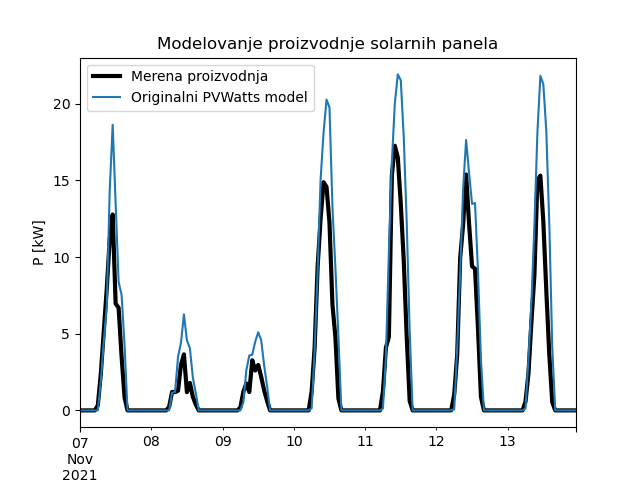

.. _solari_implementacija:

Пример прорачуна производње
==============================

Аналитички модел
-------------------

У овом одељку ћемо употребити методологију приказану у :ref:`solari_uvod` и једноставни модел *PVWatts* дат у :ref:`pvwatts` употребити на једном реалном примеру. У питању је соларна електрана са 146 инсталисаних панела на крову једне зграде. Све карактеристике инсталације су нам познате (угао нагиба, азимут, врста панела, карактеристике инвертора и слично). Од података имамо и серије температуре ваздуха и компоненти осунчаности, тако да лако можемо аналитички, по једначинама :math:numref:`eq:sapm-temp`, :math:numref:`eq:pvwatts` и :math:numref:`eq:pvwatts-inverter` да израчунамо производњу. У случају да имамо временску прогнозу, можемо приближно и да предвидимо будућу призводњу користећи стандардни *PVWatts* модел.

Иако математика није компликована, за програмску имплементацију аналитичког користићемо помоћ библиотеке PVLIB :cite:t:`holmgren2018pvlib`. На наредном листингу приказан је део кода који се тиче учитавања, припреме података и извођења *PVWatts* модела.

.. _lst_pvwatts_orig:

.. code-block:: python
    :caption: Имплементација *PVWatts* (аналитичког) модела производње
    :linenos:

    import numpy as np
    import pandas as pd
    import pvlib
    from pvlib.location import Location

    # Ucitaj podatke o vremenu i proizvodnji
    solcast_data = pd.read_csv("data_21.08.16_22.10.14.csv", index_col="Time")
    solcast_data.index = pd.to_datetime(solcast_data.index, dayfirst=True)

    # Nagib, azimut i lokacija panela
    surface_tilt = 7
    surface_azimuth = 290
    location = Location(latitude=43.905410, longitude=20.341986, altitude=243, tz="Europe/Belgrade", name="Pons Cacak")

    # Pomeri vreme za pola sata, izracunaj poziciju sunca u svakom trenutku
    times = solcast_data.index - pd.Timedelta('30min')
    solar_position = location.get_solarposition(times)
    solar_position.index += pd.Timedelta('30min')

    # Novi dataframe sa vrednostima za vrednosti osuncanosti DNI, GHI, DHI
    df_poa = pvlib.irradiance.get_total_irradiance(
        surface_tilt=surface_tilt,
        surface_azimuth=surface_azimuth,
        dni=solcast_data['DNI'],
        ghi=solcast_data['GHI'],
        dhi=solcast_data['DHI'],
        solar_zenith=solar_position['apparent_zenith'],
        solar_azimuth=solar_position['azimuth'],
        model='isotropic')

    # Izvuci ukupnu POA vrednost iz df_poa
    E_data = df_poa["poa_global"]
    # Izvuci temperaturu vazduha
    T_data = solcast_data["Tamb"]
    # Izvuci proizvodnju P
    P_data = solcast_data["P"]

    # Nedelju dana za treniranje
    E_data_train = E_data.loc["2021-10-31":"2021-11-06"]
    T_data_train = T_data.loc["2021-10-31":"2021-11-06"]
    P_data_train = P_data.loc["2021-10-31":"2021-11-06"]

    # Sledecih nedelju dana za testiranje
    E_data_test = E_data.loc["2021-11-07":"2021-11-13"]
    T_data_test = T_data.loc["2021-11-07":"2021-11-13"]
    P_data_test = P_data.loc["2021-11-07":"2021-11-13"]

    #
    # Parametri modela
    #
    pdc0 = 0.375 # nominal power [kWh]
    Tref = 25.0 # cell reference temperature
    gamma_pdc = -0.005 # influence of the cell temperature on PV system
    pdc0_inv = 50
    eta_inv_nom = 0.96
    eta_inv_ref = 0.9637
    pac0_inv = eta_inv_nom * pdc0_inv # maximum inverter capacity
    a = -2.98 # cell temperature parameter
    E0 = 1000 # reference irradiance
    deltaT = 1 # cell temperature parameter
    num_of_panels = 146 # Broj panela u instalaciji

    #
    # Originalni PVWAtts model
    #
    def orig_pvwatts_model(x):
        Ta = x[:,0:1] # Temperatura vazduha
        E = x[:,1:2] # Ukupna POA osuncanost
        
        Tm = E * np.exp(a) + Ta # Nemamo brzinu vetra
        Tc = Tm + E/E0*deltaT
        P_dc_temp = ((Tc-Tref) * gamma_pdc + 1.)
        P_dc = (E * 1.e-03 * pdc0 * P_dc_temp) * num_of_panels
        zeta = (P_dc+1.e-2)/pdc0_inv
        
        eta = eta_inv_nom/eta_inv_ref * (-0.0162*zeta - 0.0059/zeta + 0.9858)
        eta[eta<0] = 0.
        ac = np.minimum(eta*P_dc, pac0_inv)
        
        return ac

Након стандардних импорта библиотека, учитавамо сатне серије података о времену:

- ``Ta`` - температура ваздуха,
- ``DNI``, ``GHI``, ``DHI`` - компоненте оснучаности

и податке о производњи ``P`` у *Pandas* оквир. На жалост, немамо доступне податке о брзини ветра на локацији, па ту компоненту нећемо моћи да уврстимо у модел. Функција ``pvlib.irradiance.get_total_irradiance()`` библиотеке *PVLIB* уме да нам израчуна положај сунца за било који временски тренутак и било коју локацију на Земљи, а на основу њега и укупну осунчаност панела чији је положај дат угловима ``surface_tilt`` и ``surface_azimuth``, а на основу компоненти ``DNI``, ``GHI`` и ``DHI``. 

Након екстракције периода од недељу дана од 31. октобра до 6. новембра и другог периода од 7. до 13. новембра, постављамо све параметре који се користе у једначинама :math:numref:`eq:sapm-temp`, :math:numref:`eq:pvwatts` и :math:numref:`eq:pvwatts-inverter` онако како најбоље одговара самој инсталацији. Сви параметри осим два су константе прихваћене у литератури. Та два параметра чија вредност може да се скалира су ``a`` из израза :math:numref:`eq:sapm-temp` и ``gamma_pdc`` из израза :math:numref:`eq:pvwatts`. Њихове вредности (-2,98 и -0,005 респективно) псотављамо према врсти панела и начину постављања. 

Поређење резултата добијених чистим моделом и мерених вредности може се видети на :numref:`pvwatts-pons`. Очигледно је да постоји значајно одступање, тј. модел даје веће вредности од мерења. Корен средње квадратне грешке (*RMSE*) износи чак 2,46kW. Одређени допринос оволикој ведности грешки сигурно је последица чињенице да хлађење панела услед утицаја ветра нисмо узели у обзир услед недостатка података о ветру. 

.. _pvwatts-pons:

    Поређење чистог *PVWAtts* модела са мереном производњом

Ниједан модел није савршена слика стварности и не може да обухвати све факторе који утичу на производњу. Чак иако је модел савршен (а не може бити), могуће су појаве грешака при мерењу температуре, осунчаности, брзине ветра. Даље, код самог модела имамо више параметара чије вредности узимамо из литературе и декларације произвођача. Реалне вредности тих параметара сигурно одступају од тих вредности и мењају се током животног века уређаја. 

Подешавање параметра помоћу ФЗНМ
----------------------------------

Поставља се питање да ли вредности које даје модел могу бити приближније реалним вредностима подешавањем параметара модела? Пробаћемо да искористимо чињеницу да податке о производњи за недељу од 31. октобра имамо и да помоћу ФЗНМ пробамо да "помиримо" излаз аналитичког модела и мерења производње тако што ћемо параметар ``a`` прогласити непознатим. Основна идеја је да се ФЗНМ тренира и једначином и подацима и да као излаз испоручи и модел са мањом грешком и нову, бољу вредност параметра ``a``.  

На следећем листингу могу се видети интересантни делови имплементације ове идеје:

.. code-block:: python
    :caption: Инверзни проблем подешавања параметара PVWatts/SAPM модела
    :linenos:

    # Parametar "a" pustamo da se trenira
    a_var = dde.Variable(-4.0)

    #
    # Jednacina koju koristi PINN
    #
    def pvwatts_eq(x, y):
        Ta = x[:,0:1] # Temperatura vazduha
        E = x[:,1:2] # Ukupna POA osuncanost
        
        Tm = E * tf.exp(a_var) + Ta # Nemamo brzinu vetra
        Tc = Tm + E/E0*deltaT
        P_dc_temp = ((Tc-Tref) * gamma_pdc + 1)
        P_dc = (E * 1.e-03 * pdc0 * P_dc_temp) * num_of_panels
        zeta = (P_dc+1.e-2)/pdc0_inv

        eta = eta_inv_nom/eta_inv_ref * (-0.0162*zeta - 0.0059/zeta + 0.9858)
        eta = tf.maximum(0., tf.sign(eta)) * eta
        ac = tf.minimum(eta*P_dc, pac0_inv)

        return y - ac

    # Imamo 168 tacaka sa merenjima prozivodnje. Pripremi strukturu za PointSet granicni uslov
    train_points = np.zeros((168,2))
    train_measured_production = np.zeros((168,1))
    train_points[:,0] = T_data_train.to_numpy().T
    train_points[:,1] = E_data_train.to_numpy().T
    train_measured_production[:,0] =  P_data_train.to_numpy().T

    # Imamo 168 tacaka sa merenjima za narednu nedelju za test
    test_points = np.zeros((168,2))
    test_measured_production = np.zeros((168,1))
    test_points[:,0] = T_data_test.to_numpy().T
    test_points[:,1] = E_data_test.to_numpy().T
    test_measured_production[:,0] =  P_data_test.to_numpy().T

    # Minimumi i maksimumi T i E za kreiranje geometrije problema
    minT, maxT = min(train_points[:,0]), max(train_points[:,0])
    minE, maxE = min(train_points[:,1]), max(train_points[:,1])

    geom = dde.geometry.Rectangle([minT, minE], [maxT, maxE])
    bc_y = dde.icbc.PointSetBC(train_points, train_measured_production, component=0)

    # Isti broj kolokacionih tacaka za jednacinu i za granicne uslove. Moze i drugacije.
    data = dde.data.PDE(geom, pvwatts_eq, [bc_y], 168, 168, solution = orig_pvwatts_model, num_test=100)

    layer_size = [2] + [30] * 5 + [1]
    activation = "tanh"
    initializer = "Glorot uniform"
    net = dde.nn.FNN(layer_size, activation, initializer)

    variable_a = dde.callbacks.VariableValue(a_var, period=1000)
    model = dde.Model(data, net)

    model.compile(optimizer="adam", lr=0.001, metrics=["l2 relative error"], external_trainable_variables=[a_var])
    losshistory, train_state = model.train(iterations=20000, callbacks=[variable_a])
    predicted_test = model.predict(test_points)

    # Predikcije manje od nule nemaju smisla. Nuluj ih.
    predicted_test[predicted_test<0]=0

Као и код ранијих инверзних проблема који користе библиотеку DeepXDE, сетујемо параметар као варијаблу чија се вредност добија процесом обучавања:

.. code-block:: python

    a_var = dde.Variable(-4.0)

Ако погледамо функцију ``pvwatts_eq(x, y)``, она је готово идентична функцији ``orig_pvwatts_model(x)`` са :numref:`lst_pvwatts_orig`. Разлика је у томе што ``pvwatts_eq(x, y)`` не враћа вредност снаге већ функцију губитка, као што смо већ навикли. Још једна разлика огледа се у коришћењу *TensorFlow* логике уместо условног израза:

.. code-block:: python
    
    eta = tf.maximum(0., tf.sign(eta)) * eta

Овај израз није ништа друго него услов да ако имамо нефизичку вредност ``eta<0`` поставимо да је ``eta=0``. Овом формулацијом избегавамо инстукцију условног скока, која се на графичком процесору изводи доста спорије од рачуна у покретном зарезу. 

У даљем току програма треба да поставимо структуру за посебан гранични услов ``PointSet``, који смо већ користили у одељку :ref:`oscilacije_inverzni`:

.. code-block:: python

    train_points = np.zeros((168,2))
    train_measured_production = np.zeros((168,1))
    train_points[:,0] = T_data_train.to_numpy().T
    train_points[:,1] = E_data_train.to_numpy().T
    train_measured_production[:,0] =  P_data_train.to_numpy().T

    bc_y = dde.icbc.PointSetBC(train_points, train_measured_production, component=0)

Имамо укупно 168 тачака (7x24) мерења производње које ћемо искористити у покушају да "спустимо" вредности које даје оригинални модел. Геометрију проблема који решавамо дефинишемо опсегом улазних варијабли температуре и укупне осунчаности, које се узимају из табеле података. Онда можемо да поставимо и колокационе тачке на домену линијом:

.. code-block:: python

    data = dde.data.PDE(geom, pvwatts_eq, [bc_y], 168, 168, solution = orig_pvwatts_model, num_test=100)

За број случајних колокационих тачака унутар домена узели смо исти број тачака колико имамо у ``PointSet`` граничном услову. Ово не мора да се ради на тај начин, па остављамо читаоцу да експериментише. Остатак кода је мање-више исти као код свих других примера који користе DeepXDE за решавање инверзних проблема. Ту је постављање архитектуре ФЗНМ и хипер-параметара, алгоритма оптимизације, стопе обуке, *callback* функције за штампу тренутне вредности ``a_var`` током обуке и слично. На крају се анулирају негативне вредности предвиђене производње јер немају физичког смисла. 