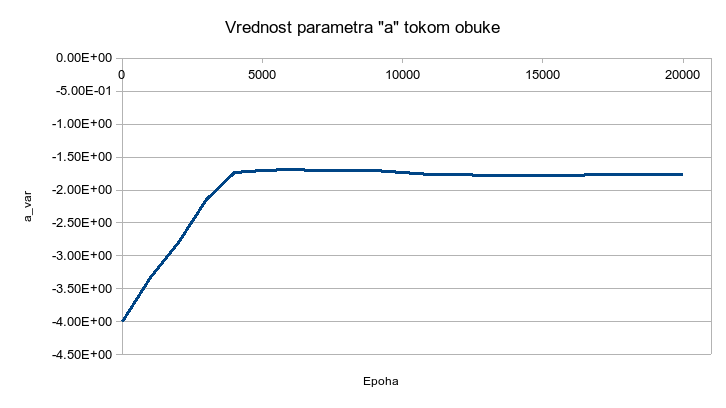

.. _solari_rezultati:

Резултати
===========

На дијаграму :numref:`pinn-pons` може видети резултат приступа описаног у одељку :ref:`solari_implementacija`. Ради поређења, на слици је остао приказан и график са :numref:`pvwatts-pons`. 

.. _pinn-pons:

.. figure:: pinn-pons.png
    :width: 80%

    Поређење ФПНМ модела и чистог *PVWAtts* модела са мереном производњом

Очигледно је да ФПНМ модел даје боље резултате од чистог *PVWatts* модела. То потврђује и грешка која је спуштена са 2,51kW на 1,92kW. Илустрације ради, дајемо и вредност параметра ``a_var`` током обуке на :numref:`a_var`. Уместо вредности из литературе -2,98, испоставља се да подацима више одговара вредност од око -1,78. 

.. _a_var:

    Вредност параметра :math:`а` током обуке

Сигурно је да модел и даље може да се подешава, рецимо укључивањем варијације још неког параметра, као што је ``gamma_pdc``. Међутим, овде се тиме нећемо бавити јер смо у довољној мери постигли циљ, тј. показали начин рада са овом врстом проблема. Читалац може да проба и неки други приступ јер су сви потребни подаци доступни у репозиторијуму практикума. 
