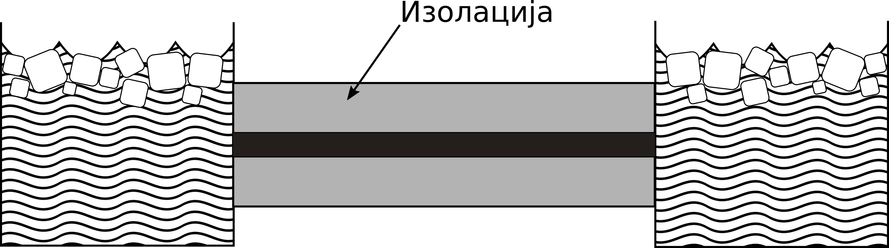

.. _stap:

Једнодимензиони проблем
=========================

Танак штап од хомогеног материјала је окружен изолацијом, тако да се промене температуре у штапу дешавају само као последица размене топлоте ка крајевима штапа и провођења топлоте дуж штапа. Штап је јединичне дужине. Оба краја су изложена мешавини воде и леда температуре 0. Почетна температура на растојању *x* од левог краја штапа је :math:`100\sin{(\pi x)}`, као што се види на :numref:`fdheat`.

.. _fdheat:

    Експериментална поставка проблема провођења топлоте дуж штапа. На крајевима штапа налази се мешавина воде и леда. Штап је изолован од утицаја спољашње средине.

.. _fdheat1:

Решавање методом коначних разлика
-----------------------------------

.. figure:: fdheat1.png
    :width: 80%

    Како време тече, штап се хлади. Метода коначних разлика омогућава израчунавање температуре у фиксном броју тачака у равномерним временским интервалима. Смањење просторног и временског корака доводи до прецизнијег решења.

Парцијална диференцијална једначина :math:numref:`eq:toplota1` уз претпоставку да је :math:`\alpha=1` моделује температуру у било којој тачки штапа у било ком временском тренутку према :cite:t:`recktenwald2004finite`. Ова једначина се решава методом коначних разлика која даје апроксимацију решења за распоред температуре, примењујући просторну и временску дискретизацију. Програмска имплементација решења чува температуру сваке тачке дискретизације у дводимензионој матрици. Сваки ред садржи температурну дистрибуцију штапа у неком тренутку времена. Штап је подељен на $n$ делова дужине *h*, па стога сваки ред има *n+1* елемената. Што веће *n*, мања је грешка апрокцимације . Време од 0 до *T* је подељено у *m* дискретних интервала дужине *k*, па стога матрица има *m+1* редова, :numref:`fdheat2`. 

.. _fdheat2:

    Дискретизација једначине провођења топлоте методом коначних разлика

Свака тачка :math:`u_{i,j}`` представља елемент матрице који садржи температуру на позицији :math:`i \cdot h`, у тренутку :math:`j \cdot k`. На крајевима штапа је температура увек нула. У почетном тренутку, температура у тачки *x* је, као што је већ речено, :math:`100\sin{(\pi x)}`. Алгоритам иде корак по корак кроз време, користи вредности из тренутка *j* да би израчунао вредности у тренутку *j+1*. Формула се овде даје без извођења и гласи:

.. math::
    :label: eq:diskretna

    u_{i,j+1} = R \cdot u_{i-1,j}+(1-2R) \cdot u_{i,j} + R \cdot u_{i+1,j},

где је

.. math::

    R = \frac{k}{h^2}.
