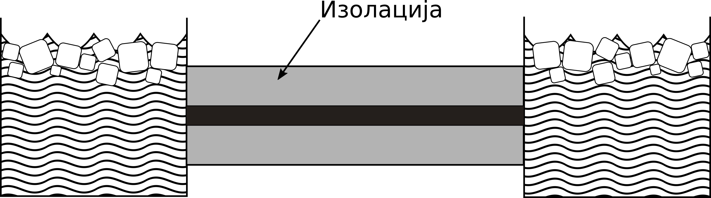
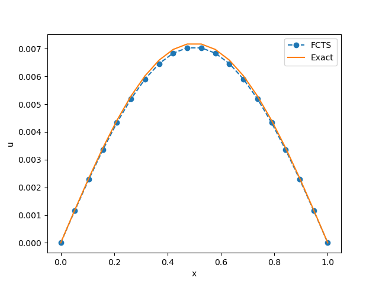
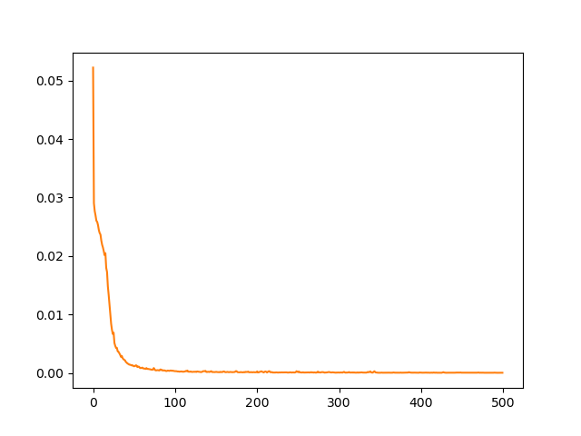
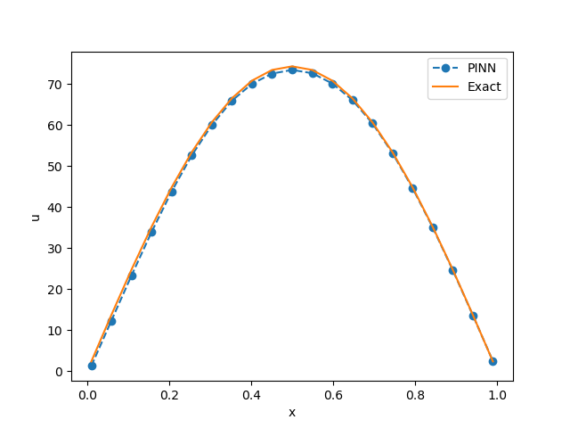

.. _stap:

Једнодимензиони директни проблем
==================================

Танак штап од хомогеног материјала је окружен изолацијом, тако да се промене температуре у штапу дешавају само као последица размене топлоте ка крајевима штапа и провођења топлоте дуж штапа. Штап је јединичне дужине. Оба краја су изложена мешавини воде и леда температуре 0. Почетна температура на растојању :math:`x` од левог краја штапа је :math:`sin{(\pi x)}`, као што се види на :numref:`fdheat`.

.. _fdheat:

    Експериментална поставка проблема провођења топлоте дуж штапа. На крајевима штапа налази се мешавина воде и леда. Штап је изолован од утицаја спољашње средине.

Ради поређења, показаћемо сада како се овај релативно једноставан проблем формулише помоћу класичне методе коначних разлика, а затим ћемо га решити директни и инверзни проблем ФЗНН методом. 

Решавање методом коначних разлика (МКР)
-----------------------------------------

Парцијална диференцијална једначина :math:numref:`eq:toplota1` моделује температуру у било којој тачки штапа у било ком временском тренутку према :cite:t:`recktenwald2004finite`. Ова једначина се решава методом коначних разлика која даје апроксимацију решења за распоред температуре, примењујући просторну и временску дискретизацију. Програмска имплементација решења чува температуру сваке тачке дискретизације у дводимензионој матрици. Сваки ред садржи температурну дистрибуцију штапа у неком тренутку времена. Штап је подељен на *n* делова дужине *h*, па стога сваки ред има *n+1* елемената. Што веће *n*, мања је грешка апрокцимације. Време од 0 до *T* је подељено у *m* дискретних интервала дужине *k*, па стога матрица има *m+1* редова, :numref:`fdheat2`.

.. _fdheat1:

    Како време тече, штап се хлади. Метода коначних разлика омогућава израчунавање температуре у фиксном броју тачака у равномерним временским интервалима. Смањење просторног и временског корака доводи до прецизнијег решења.

.. _fdheat2:

    Дискретизација једначине провођења топлоте методом коначних разлика

Свака тачка :math:`u_{i,j}`` представља елемент матрице који садржи температуру на позицији :math:`i \cdot h`, у тренутку :math:`j \cdot k`. На крајевима штапа је температура увек нула. У почетном тренутку, температура у тачки *x* је, као што је већ речено, :math:`sin{(\pi x)}`. Алгоритам иде корак по корак кроз време, користи вредности из тренутка *j* да би израчунао вредности у тренутку *j+1*. Формула која репрезентује варијанту апроксимације FTCS (*Forward Time Centered Space*) као у :cite:t:`recktenwald2004finite` се овде даје без извођења и гласи:

.. math::
    :label: eq:diskretna

    u_{i,j+1} = R \cdot u_{i-1,j}+(1-2R) \cdot u_{i,j} + R \cdot u_{i+1,j},

где је

.. math::

    R = \alpha \frac{k}{h^2}.

Целокупна анализа различитих експлицитних и имплицитних метода дата је на поменутој референци, а кључни део кода у програмском језику Пајтон имплемениран је на следећи начин:

.. code-block:: python
   :linenos:

    def heatFTCS(nt=10, nx=20, alpha=0.3, L=1, tmax=0.1):
        h = L / (nx - 1)
        k = tmax / (nt - 1)
        r = alpha * k / h**2

        x = np.linspace(0, L, nx)
        t = np.linspace(0, tmax, nt)
        U = np.zeros((nx, nt))

        # Почетни услов
        U[:, 0] = np.sin(np.pi * x / L)

        # Главна петља за МКР
        for m in range(1, nt):
            for i in range(1, nx-1):
                U[i, m] = r * U[i - 1, m - 1] + (1-2*r) * U[i, m-1] + r * U[i+1, m-1]

        # Егзактно решење за поређење
        ue = np.sin(np.pi * x / L) * \
            np.exp(-t[nt - 1] * alpha * (np.pi / L) * (np.pi / L))

Као што је детаљно објашњава :cite:t:`recktenwald2004finite`, ако се МКР петља формулише експлицитно као што је то случај код FTCS технике, мора се пажљиво изабрати временски и просторни корак како би нумеричка пропагација била "бржа" од физичке. Решење се може видети на :numref:`ftcs`.

.. _ftcs:

    Решење које се добија МКР методом користећи експицитну FTCS технику у тренутку *t=0.1s*. 

Овај проблем има и аналитичко решење, па је погодан за тестирање различитих нумеричких метода. То решење гласи:

.. math:: 
    :label: eq:analiticko1

    u(x,t) = \sin\left(\frac{\pi x}{L}\right) \cdot e^{-\frac{\alpha\pi^2}{L^2}t}.

или у нашем случају када је *L=1*:

.. math:: 

    u(x,t) = \sin(\pi x) \cdot e^{-\alpha \pi^2 t}.

Експлицитне технике попут FTCS не гарантују конзистентност решења коју гарантују имплицитне технике као што је BTCS (*Backward Time Centered Space*). МКР је устаљени приступ који за већину правилно дефинисаних домена ради веома добро. За овако једноставну поставку као што је једнодимензионо провођење топлоте и када су сви параметри проблема познати (овде је то :math:`\alpha`), МКР је често оптимална метода. Међуутим, код већине проблема из праксе то није случај. Хајде да размотримо како да овај проблем решимо користећи ФЗНН и директно упоредимо са МКР. 

Решавање помоћу ФЗНН
-----------------------------------------

Решење једначине :numref:`fdheat` са већ постављеним граничним и почетним условима:

.. math:: 
    :label: eq:granicni1

    u(x=0,t)=u(x=1,t)=0, \, \forall t \\
    u(x,t=0) = sin{(\pi x)}

потражићемо помоћу ФЗНН приступа. Иако је могуће да методе имплементирамо директно као :cite:t:`raissi2019physics` користећи оквира за дубоко учење као што је `Tensorflow <https://www.tensorflow.org/>`_, користићемо помоћ додатних библиотека које додатно апстрахују ФЗНН ентитете и омогућавају кориснику да се фокусира на проблема који решава. Овај пример решићемо користећи бибиотеку `SCIANN <https://www.sciann.com/>`_ аутора :cite:t:`haghighat2021sciann`. Поступак решавања објаснићемо кроз програмски код:

.. code-block:: python
   :caption: ФЗНН - провођење топлоте
   :linenos:

    import numpy as np
    import sciann as sn
    from sciann.utils.math import diff, sign, sin, sqrt, exp
    from numpy import pi

    x = sn.Variable('x')
    t = sn.Variable('t')
    u = sn.Functional('u', [x,t], 3*[20], 'tanh')
    alpha = 0.3

    L1 = diff(u, t) - alpha * diff(u, x, order=2)

    TOLX = 0.011
    TOLT = 0.0011
    C1 = (1-sign(t - TOLT)) * (u - sin(pi*x))
    C2 = (1-sign(x - (0+TOLX))) * (u)
    C3 = (1+sign(x - (1-TOLX))) * (u)

    m = sn.SciModel([x, t], [L1, C1, C2, C3], 'mse', 'Adam')

    x_data, t_data = np.meshgrid(
        np.linspace(0, 1, 101), 
        np.linspace(0, 0.1, 101)
    )

    h = m.train([x_data, t_data], 4*['zero'], learning_rate=0.002, batch_size=256, epochs=500)
    
    # Test
    nx, nt = 20, 10
    x_test, t_test = np.meshgrid(
        np.linspace(0.01, 0.99, nx+1), 
        np.linspace(0.01, 0.1, nt+1)
    )
    u_pred = u.eval(m, [x_test, t_test])

Варијабле *x* и *t* се на поечтку дефинишу на прописани начин. Основни појам који се користи у SCIANN библиотеци за апстракцију ФЗНН је функционал, који је овде означен са *u*, као улаз узима *x* и *t*, има 3 скривена слоја са по 20 неурона и као активацију свих неурона узима функцију хиперболичког тангенса. Први сабирак копозитне функције губитка произилази из саме диференцијалне једначине :math:numref:`eq:toplota1`. Као што се види, за диференцирање се користи специјални оператор ``diff()`` из библиотеке:

.. code-block:: python
    
    L1 = diff(u, t) - alpha * diff(u, x, order=2)

Најзанимљивији и не баш тако очигледан је начин дефинисања почетног услова ``C1`` и граничних услова ``C2`` и ``C3``:

.. code-block:: python

    C1 = (1-sign(t - TOLT)) * (u - sin(pi*x))
    C2 = (1-sign(x - (0+TOLX))) * (u)
    C3 = (1+sign(x - (1-TOLX))) * (u)

На пример, ``C1`` је нула у свим тачкама узорковања осим за :math:`t \le TOLT`. Толеранције *TOLX* и *TOLT* су постављене тако да "хватају" прву/последњу врсту/колону, у зависности шта је потребно. Уместо функције знака ``sign()``, могу се користити и глаткије функције, као што је хиперболички тангенс. ФЗНН модел се формира помоћу `SciModel` конструктора који дефинише и тип функције губитка и алгоритам оптимизације, тј. обучавања:

.. code-block:: python

    m = sn.SciModel([x, t], [L1, C1, C2, C3], 'mse', 'Adam')

Обучавање модела се покреће методом ``train()``, при чему се наводе следећи параметри:

#. **Скуп колокационих тачака за тренирање**.  Овде је то правилна еквидистантна мрежа тачака по обе варијабле. 
#. **Почетне вредности компоненти функције губитка**. Уобичајено је да се на почетку поставе на нуле.
#. **Стопа учења**,
#. **Величина *batch*-a**. Треба имати на уму да ако је број тачака домена у којима се намећу гранични услови значајно мањи у односу на укупан број колокационих тачака, параметар  оптимизације ``batch_size`` треба да буде подешен на велики број који гарантује доследну оптимизацију мини *batch*-a. У супротном, може да се деси да неки мини *batch*-еви не добију никакве податке о граничним условима и стога не генеришу тачан градијент за ажурирање методом градијентног спуста. 
#. **Број епоха**.

.. _loss1:

    Историја обуке једнодимензионог модела провођења топлоте.

Ток обуке можемо да испратимо кроз стандардне *Tensorflow* објекте, као што је ``h.history['loss']``, као што се види на :numref:`loss1`. Пошто се заврши обука ФЗНН-а, можемо формирати тестни скуп тачака слично као што смо то учинили и са колокационим тачкама и проверити резултате предикције позивом методе ``eval()`` на објекту модела. Резултат поља темперљатуре дуж штапа у тренутку *t=0,1* и његово поређење са егзактним решењем види се на :numref:`heat1`.

.. _heat1:

    Поље температуре дуж штапа у тренутку *t=0,1* добијен методом ФЗНН.

Чисто практично гледано, **ФЗНН решење једноставног директног проблема као што је овај и не пружа никакве посебне предности у односу на класичну МКР методу**. Прво, решавање дуже траје и захтева упошљавање више рачунарских ресурса и зависности у воду додатних библиотека за тензорски рачун. Даље, спецификација почетних и граничних услова код ФЗНН има своје специфичности. Треће, неопходно је методом пробе и грешке подесити хипер-параметре модела, као што су: број скривених слојева, број неурона по слоју, активациона функција, брзина учења (*learning rate*) итд. Од ових хипер-параметара конвергенција решења може пуно да зависи. 

Са друге стране, за разлику од МКР и МКЕ (*Метода Коначних Елемената*), ФЗНН нам дозвољава да проблем дефинишемо чистим диференцијалним једначинама и произвољним граничним условима (Дирихлеови, Нојманови, периодични, скуп тачака). Нема потребе за дефинисањем алгебарске везе између чворова (тј. колокационих тачака) и решавањем тако постављеног система једначина. Захваљујући овој чињеници, било која нова физика у виду новог граничног услова или промена у самој диференцијалној једначини може да се изведе веома лако, омогућавајући брзу проверу хипотеза и израду прототипова. Друго, ФЗНН методолошки не разликује **директне проблеме** (у којима се решава позната диференцијална једначина) од **инверзних проблема** код којих су неки од параметара непознати, али постоје додатни услови из којих се непознати параметри могу добити процесом оптимизације. У наредној теми :ref:`stap_inverzni` демонстрираћемо један такав проблем. 
