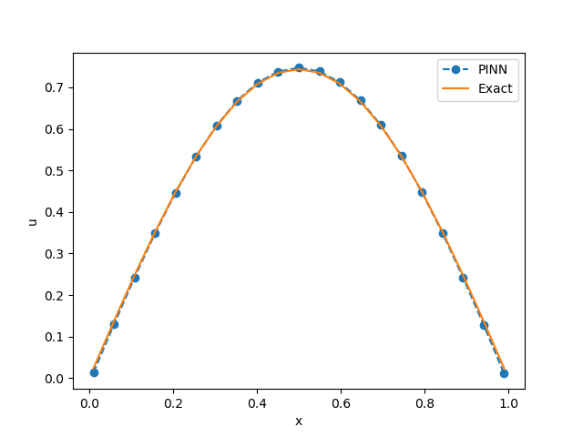

.. _stap_inverzni:

Једнодимензиони инверзни проблем
===================================

Поставка инверзног проблема је потпуно иста као и у претходном поглављу :ref:`stap`, тј. описана је :numref:`fdheat`, једначином :math:numref:`eq:toplota1` и граничним условима :math:numref:`eq:granicni1`. Међутим, овога пута нам параметар проблема :math:`\alpha` на почетку није познат и покушаћемо да га добијемо уз помоћ метода обучавања пропагацијом уназад. Наравно, чим смо увели нову непознату, морамо да уведемо и нови гранични услов. Рецимо, можемо да поставимо да је у једној тачки у неком временском тренутку, температура :math:`u` одговарала некој нумеричкој вредности која се поклапа са аналитичким решењем :math:numref:`eq:analiticko1`. Рецимо, поставимо температуру на средини штапа у :math:`x=0,5` у тренутку :math:`t=0,05` на:

.. math:: 
    u(x=0,5, t=0,05) = 0,8623931,

и покушајмо да решимо проблем постављајући граничне услове на следећи начин:

.. code-block:: python
    :caption: Проналажење непознатог параметра :math:`\alpha`
    :linenos:

    x = sn.Variable('x')
    t = sn.Variable('t')
    u = sn.Functional('u', [x,t], 3*[20], 'tanh')
    alpha = sn.Parameter(0.5, inputs=[x,t], name="alpha")

    L1 = diff(u, t) - alpha * diff(u, x, order=2)

    TOL = 0.011
    TOLT= 0.0011
    C1 = (1-sign(t - TOLT)) * (u - sin(pi*x))
    C2 = (1-sign(x - (0+TOL))) * (u)
    C3 = (1+sign(x - (1-TOL))) * (u)
    C4 = (1 + sign(t-0.049)) * (1 - sign(t-0.051)) * (1 + sign(x-0.49)) * (1 - sign(x-0.51)) * (u-0.8623931)

    m = sn.SciModel([x, t], [L1, C1, C2, C3, C4], 'mse', 'Adam')

    x_data, t_data = np.meshgrid(
        np.linspace(0, 1, 101), 
        np.linspace(0, 0.1, 101)
    )

    h = m.train([x_data, t_data], 5*['zero'], learning_rate=0.002, batch_size=512, epochs=1200, 
        adaptive_weights={'method':'NTK', 'freq':100})

    # Test
    nx, nt = 20, 10
    x_test, t_test = np.meshgrid(
        np.linspace(0.01, 0.99, nx+1), 
        np.linspace(0.01, 0.1, nt+1)
    )
    u_pred = u.eval(m, [x_test, t_test])

    print(alpha.value)

Очигледно је да је код готово исти као претходни у коме се решава директни проблем, јер је и методологија за решавање директних и инверзних проблема код ФПНМ идентична. Једина разлика је у поставци. Линија 4 поставља :math:`\alpha` као непознати параметар и даје му почетну вредност. У линији 13 се поставља додатни гранични услов у тачки ``u(x=0.4,t=0.05)``, који ће постати још једна компонента композитне функције губитка која се формира у линији 15. Вредност непознатог параметра се штампа у последњој линији и у нашем тесту износи око 0,308, што је довољно блиско реалној вредности од 0,3. Потврда задовољавајућег решења инверзног проблема приказана је и графички на :numref:`heat-inv1`. 

.. _heat-inv1:

    Поље температуре дуж штапа у тренутку :math:`t=0,1` добијено решавањем инверзног проблема
