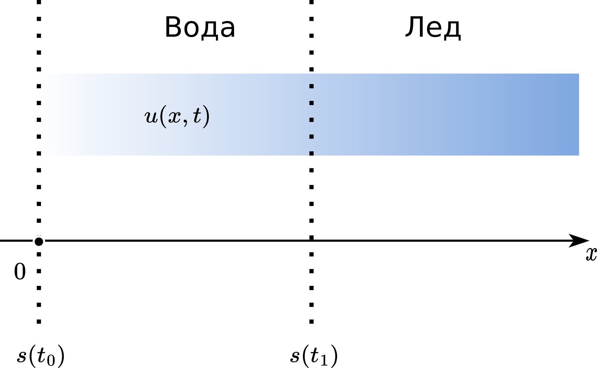

.. _stefan:

Стефанов проблем у моделима топљења
=======================================

Након што смо успешно решили и директни и инверзни проблем провођења топлоте који је описан једноставном параболичном парцијалном диференцијалном једначином, позабавићемо се мало компликованијом поставком сличног проблема, пре свега имајући у виду граничне услове. Овде ће се они динамички мењати у зависности од градијента температуре. Показаћемо да је заправо овај проблем лакше и природније решавати помоћу ФЗНН-а него помоћу класичних нумеричких метода базираних на мрежи интеграционих тачака (МКЕ, МКР). 

Стефанови проблеми фазних промена имају примену у разним областима науке и инжењерства, када год се фаза посматране супстанце мења између течног, чврстог или гасовитог стања. Претпоставља се да материјал пролази кроз фазну промену са кретањем границе чији је положај непознат и мора се одредити као део саме нумеричке анализе. Пошто проблеми са померањем граница захтевају решавање топлотне једначине у непознатој области која се такође мора одредити као део решења, они су инхерентно нелинеарни.

Проблем једнодимензионалне промене фазе могао би се демонстрирати помоћу полубесконачног чврстог тела, као што је танак блок леда који заузима :math:`0 \leq x < \infty`, на температури очвршћавања. На фиксној граници танког блока леда :math:`x=0`, могу да делују различите врсте флукса. У овом примеру користимо исти гранични услов као :cite:t:`IvanovicSvicevic`, :cite:t:`SavovicCaldwell2009`, тако се температура при :math:`x=0` повећава експоненцијално са временом. Такође, прописујемо да се читава чврста фаза налази на температури топљења. Стога сводимо проблем на одређивање расподела температуре у течној фази у време :math:`t_0` где је :math:`x < s(t_0)`, као и положаја границе између фаза :math:`s(t_0)`. У неком каснијем временском тренутку :math:`t_1 > t_0`, покретна граница :math:`s(t)` креће се удесно, заузимајући позицију :math:`s(t_1) > s (t_0) = s_0`, као што је приказано на :numref:`stefan1`. Део танког блока леда од позиције :math:`s(t_0)` до позиције :math:`s(t_1)`, отопио се током временског интервала :math:`(t_0,t_1)`.

.. _stefan1:

    1-Д Стефанов проблем. :math:`s(t)` означава покретну границу, а :math:`u(x,t)`` температуру течне фазе (за :math:`x<s`).

Дистрибуција температуре :math:`u(x,t)` у региону у коме влада течно стање :math:`0 \leq x \leq s(t)` дата је топлотном једначином:

.. math:: 

    \frac{\partial u}{\partial t} = \alpha \cdot \frac{\partial^2 u}{\partial x^2},

која може да се напише на следећи начин:

.. math:: 
    :label: eq:stefan-jednacina

    \frac{\partial u}{\partial t} - \alpha \cdot \frac{\partial^2 u}{\partial x^2} = 0,

под следећим граничним условима:

.. math:: 
    :label: eq:stefan-granicni

    u(x,t) = e^{\alpha t}, \quad x = 0, \quad t > 0  \\
    u(x,t) = 1,\quad x = s(t), \quad t > 0.

Овде :math:`\alpha`, као и у претходним примерима означава физички параметар који комбинује топлотну проводност, густину и специфичну топлоту. Позиција покретне границе дата је једначином која је позната као Стефанов услов:

.. math::
    :label: eq:stefancond

    \frac{1}{\alpha} \cdot \frac{ds}{dt} = - \frac{\partial u}{\partial x}, \quad x = s(t), \quad t > 0.

У општем случају, почетни услов за положај границе фаза дат је са:

.. math:: 
    :label: eq:stefan-granicni1

    s(0) = 0.

За овако постављен проблем познато је и аналитичко решење, и то:

.. math:: 

    u(x,t) = e^{\alpha t} - x \\
    s(t)  = \alpha t. 

Решавање овог проблема ФЗНН приступом подразумева конструкцију две неуронске мреже. Прва ће апроксимирати дистрибуцију температура :math:`u(x,\ t)` док ће друга апроксимирати положај слободне границе између фаза :math:`s(t)`. Апроксимативна решења биће аутоматски диференцирана у односу на улазне варијабле од којих зависе, за вредности дефинисане скупом колокационих тачака из домена :math:`\lbrack 0,T\rbrack \times \mathcal{D}`, где је :math:`\mathcal{D \subset}\mathbb{R}^{d}` ограничени домен, а :math:`T` означава конално време симулације. Функција губитка састоји се из компоненти изведених из :math:numref:`eq:stefan-jednacina`, :math:numref:`eq:stefan-granicni` и :math:numref:`eq:stefan-granicni1`, користећи апрокцимације за :math:`u` и :math:`s` у колокационим тачкама, које покривају како унутрашњост домена, тако и домене у којима важе почетни и гранични услови.

Конструкција функције губитка
--------------------------------

Као што је већ речено, прва мрежа апроксимира функцију температуре :math:`u(x,t)`, а друга мрежа апроксимира положај слободне границе између фаза :math:`s(t)`. Функција губитка састоји се из разлике :math:`u` и :math:`s` и њихових апроксимација :math:`\widehat{u}` и :math:`\widehat{s}` које даје ФЗНН и који представљају
резидууме које даје главна диференцијална једначина, почетни и гранични услови. Дакле, укупан губитак :math:`\mathcal{L}` одређен је сумом резидуума:

.. math::
    :label: eq:stefan-loss1

    \mathcal{L} = \mathcal{L}_r + \mathcal{L}_0 + \mathcal{L}_{b_{1}} + \mathcal{L}_{b_{2}} + \mathcal{L}_{b_{3}},

где су:

.. math::
    :label: eq:stefan-loss2

    \mathcal{L}_r = \frac{1}{N_r}\sum_{i = 1}^{N_r}{\left| \frac{\partial\widehat{u}(x,t)}{\partial t} - \alpha\frac{\partial^{2}\widehat{u}(x,t)}{\partial x^2} \right|^2}, \\
    \mathcal{L}_0 = \frac{1}{N_{0}}\sum_{i = 1}^{N_0}{\left| \widehat{s}(0) - s(0) \right|^2},  \\
    \mathcal{L}_{b_1} = \frac{1}{N_{b_1}}\sum_{i = 1}^{N_{b_1}}\left| \frac{1}{a}\frac{\partial\widehat{s}(t)}{\partial t} + \frac{\partial\widehat{u}}{\partial\widehat{s}(t)} \right|^2, \\
    \mathcal{L}_{b_2} = \frac{1}{N_{b_2}}\sum_{i = 1}^{N_{b_2}}\left| \widehat{u}(0,t) - u(0,t) \right|^{2},  \\
    \mathcal{L}_{b_3} = \frac{1}{N_{b_3}}\sum_{i = 1}^{N_{b_3}}\left| \widehat{u}\left( \widehat{s}(t),t \right) - u\left( s(t),t \right) \right|^2.

Први члан :math:`\mathcal{L}_r`` пенализује по главној диференцијалној једначини :math:numref:`eq:stefan-jednacina`, где је :math:`N_r` величина *batch*-a колокационих талака које се случајно узоркују из домена простор-временских координата које узимају вредности :math:`0 \leq x \leq 1` и :math:`0s \leq t \leq 0,5s`, респективно. :math:`\widehat{u}(x,t)` је апроксимативна неуронска мрежа температурског поља :math:`u(x,t)`. Други члан :math:`\mathcal{L}_0` одређује испуњеност граничног услова :math:numref:`eq:stefan-granicni1`. Испуњеност Стефановог граничног услова :math:numref:`eq:stefancond` дат је резидуумом :math:`\mathcal{L}_{b_1}`, где :math:`\widehat{s}(t)` означава ФЗНН апроксимацију положаја покретне границе. Последња два члана :math:`\mathcal{L}_{b_2}` и :math:`\mathcal{L}_{b_3}` одређују резуидуале граничних услова :math:numref:`eq:stefan-granicni`, где :math:`N_0, \, N_{b_1}, \, N_{b_2}`,  и :math:`N_{b_3}` означавају број колокационих тачака у којима важе почетни и гранични услови.

Имплементација
--------------------------------

Решење које користи функционалност већ познате библиотеке SCIANN дато је у следећем листингу:

.. code-block:: python
    :caption: Решење Стефановог проблема у 1Д коришћењем SCIANN библиотеке
    :linenos:

    alpha = 1.0

    # Почетни услови
    t0 = 0.1
    s0 = alpha * t0

    # Дефинисање варијабли и функционала
    x = sn.Variable('x')
    t = sn.Variable('t')
    u = sn.Functional (["u"], [x, t], 8*[30] , 'tanh')
    s = sn.Functional (["s"], [t], 8*[30] , 'tanh')

    # Диференцијална једначина
    L1 =  diff(u, t) - alpha * diff(u, x, order=2)

    TOLX=0.004
    TOLT=0.002

    # Стефанов услов
    C1 = (1/alpha*diff(s, t) + diff(u,x)) * (1 + sign(x - (s-TOLX))) * (1-sign(x-s))
    # Почетно s у тренутку t=t0
    C2 = ( s - s0 ) * (1-sign(t - (t0+TOLT)))
    # Гранични услов за u када је x=0
    C3 = ( u - exp(alpha*t) ) * (1-sign(x - (0 +TOLX)))
    # Температура на грнаици фаза је 1
    C4 = (u-1) * (1-sign(x - (s+TOLX))) * (1+sign(x-s))

    x_data, t_data = [], []

    # Тренинг скуп колокационих тачака
    x_train, t_train = np.meshgrid(
        np.linspace(0, 1, 300),
        np.linspace(t0, 0.5, 300)
    )

    x_data, t_data = np.array(x_train), np.array(t_train)

    m = sn.SciModel([x, t], [L1,C1,C2,C3,C4], 'mse', 'Adam')
    h = m.train([x_data, t_data], 5*['zero'], learning_rate=0.002, batch_size=1024, epochs=1000, adaptive_weights={'method':'NTK', 'freq':20})

    # Тест скуп
    x_test, t_test = np.meshgrid(
        np.linspace(0, 1, 300), 
        np.linspace(0.01, 0.5, 300)
    )
    u_pred = u.eval(m, [x_test, t_test])
    s_pred = s.eval(m, [x_test, t_test])

    s=[]
    for e in s_pred:
        s.append(e[0])

    # Кретање покретне границе између фаза
    fig = plt.figure()
    plt.plot(t_test[:,0], s)

    # Поље температура у крајњем временском тренутку t=0.5
    fig = plt.figure()
    plt.plot(x_test[299], u_pred[299])

На почетку (линије 1-11) постављамо константе и варијабле. Приметимо да моделовање креће од временског тренутка :math:`t_0=0,1s`. Прва заграда у изразу за *C1* 

.. code-block:: python

    C1 = (1/alpha*diff(s, t) + diff(u,x)) * (1 + sign(x - (s-TOLX))) * (1-sign(x-s))

представља сам Стефанов услов. Као што је уобичајено за постављање граничних услова, друга заграда поставља правило где тај гранични услов важи. За *C1* је тај израз мало компликованији због толеранције, али заправо представља услов да је :math:`x \approx s`. Услов

.. code-block:: python

    C2 = ( s - s0 ) * (1-sign(t - (t0+TOLT)))

дефинише положај границе у почетном тренутку. Даље, услов

.. code-block:: python

    C3 = ( u - exp(alpha*t) ) * (1-sign(x - (0 +TOLX)))

поставља динамички услов промене температуре у тачки :math:`x=0` према једначини :math:numref:`eq:stefan-granicni`. Коначно, последљи услов

.. code-block:: python

    C4 = (u-1) * (1-sign(x - (s+TOLX))) * (1+sign(x-s))

у устом скупу колокационих тачака као што је то био случај са условом *C1*, тј. на граници између фаза :math:`x \approx s` поставља вредност температуре на 1. Остатак кода је мање-више стандардно тренирање, формирање тестног скупа и екстракција података о кретању границе *s* кроз време, као и графички приказ, који се може видети на следећој слици. 
