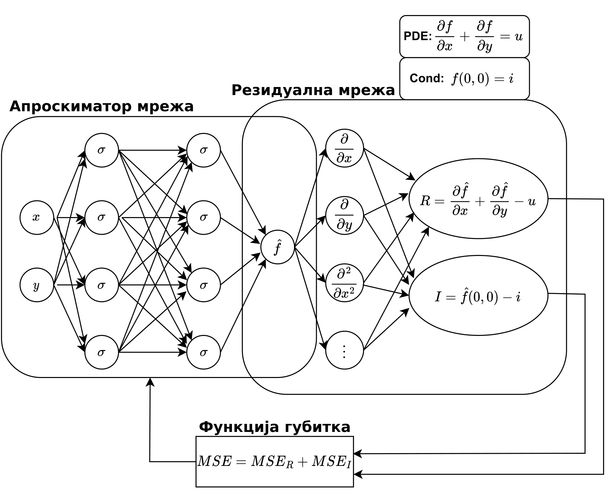

.. _metoda:

Физички поткрепљене неуронске мреже
===================================

Физички заснована неуронска мрежа (у даљем тексту ФПНМ) је техника машинског учења која може се користити за апроксимацију решења парцијалне диференцијалне једначине. Парцијалне диференцијалне једначине са одговарајућим почетним и граничним условима могу се изразити у општем облику као:

.. math::
    :label: eq:osnovne

    u_{t}\mathcal{+ N}\lbrack u\rbrack &= 0,\ \ X \in \Omega,\ t \in \lbrack 0,T\rbrack, \\
    u(X,0) &= h(X),\ \ X \in \Omega, \\
    u(X,t) &= g(X,t),\ \ X \in \Omega_{g},\ t \in \lbrack 0,T\rbrack.

Овде је :math:`\mathcal{N}` диференцијални оператор, :math:`X \in {\Omega \subseteq R}^{d}` и :math:`t \in R` представљају просторне и временске координате, респективно, док је :math:`\Omega \subseteq R` целокупни домен проблема. :math:`\Omega_{g} \subseteq \Omega` представља рачунски домен граничних услова, :math:`u(X,t)` је решење парцијалне диференцијалне једначине са почетним  условом :math:`h(X)` и граничним условом :math:`g(X,t)`. Оваква формулација се такође може применити и на парцијалне диференцијалне једначине вишег реда, пошто се једначине вишег реда могу написати и у облику система једначина првог реда.

У оригиналној формулацији :cite:t:`raissi2019physics`, ФПНМ се састоји од две подмреже:

* апроксиматор мреже и 
* резидуалне мреже. 

**Апроксиматор мрежа** прима улаз :math:`(X,t)`, пролази кроз процес обуке и као излаз даје приближно решење :math:`\widehat{u}(X,t)` парцијалне диференцијалне једначине. Мрежа апроксиматора се тренира на мрежи тачака, тзв. **колокационих тачака**, узоркованих из домена пробелма. Тежине и пристрасности апроксиматор мреже су параметри који се могу тренирати минимизирањем композитне функције губитка у следећем облику:

.. math:: 
    :label: eq:loss1

    \mathcal{L =}\mathcal{L}_{r} + \mathcal{L}_{0} + \mathcal{L}_{b},

где су

.. math:: 
    :label: eq:loss2

    \mathcal{L}_{r} = \frac{1}{N_{r}}\sum_{i = 1}^{N_{r}}{\left| u\left( X^{i},t^{i} \right) + \mathcal{N}\left\lbrack u\left( X^{i},t^{i} \right) \right\rbrack \right|^{2},} \\
    \mathcal{L}_{0} = \frac{1}{N_{0}}\sum_{i = 1}^{N_{0}}{\left| u\left( X^{i},t^{i} \right) - h^{i} \right|^{2},} \\
    \mathcal{L}_{b} = \frac{1}{N_{b}}\sum_{i = 1}^{N_{b}}\left| u\left( X^{i},t^{i} \right) - g^{i} \right|^{2}. 

Овде, :math:`\mathcal{L}_{r}`, :math:`\mathcal{L}_{0}` и :math:`\mathcal{L}_{b}` представљају губитке основне диференцијалне једначине, почетних и граничних
услова, респективно. Поред тога, :math:`N_{r}`, :math:`N_{0}` и :math:`N_{b}` су бројеви колокационих тачака домена пробелема, домена почетних и граничних услова, респективно. Ови остаци се израчунавају компонентом ФПНМ модела који се не може обучити под називом **резидуална мрежа**. Да би се израчунао остатак
:math:`\mathcal{L}_{r}`, ФПНМ захтева изводе излаза у односу на улазе. Такво израчунавање се постиже аутоматском диференцијацијом. 

Ова техника је кључни покретач развоја ФПНМ-а и кључни је елемент који разликује ФПНМ од сличних настојања 90-их година прошлог века. На пример, :cite:t:`psichogios1992` и :cite:t:`fotiadis1998` су се ослањали на мануелно извођење правила пропагације уназад. У данашње време се рачуна на аутоматску диференцијацију која је имплементиранa у већини оквира за дубоко учење, као што су `Tensorflow <https://www.tensorflow.org/>`__ и `PyTorch <https://pytorch.org/>`_. На овај начин избегавамо нумеричку дискретизацију током рачунања извода свих редова у простор-времену.

Шема ФПНМ-а је приказана на :numref:`pinnschema` на којој је једноставна парцијална диференцијална једначина :math:`\frac{\partial f}{\partial x} + \frac{\partial f}{\partial y} = 0` искоришћена као пример. Као што је приказано, мрежа апроксиматора се користи за апроксимацију решења :math:`u(X,t)`, које затим иде на резидуалну мрежу за израчунавање функције губитка диференцијалне једначине :math:`\mathcal{L}_{r}`, губитка граничних услова :math:`\mathcal{L}_{b}`, и губитка почетних услова :math:`\mathcal{L}_{0}`. Тежине и пристрасности апроксиматорске мреже обучени су коришћењем прилагођене функције губитка која се састоји од остатака :math:`\mathcal{L}_{r}`, :math:`\mathcal{L}_{0}`, и :math:`\mathcal{L}_{b}` кроз технику градијента спуштања засновану на пропагацији уназад.

.. _pinnschema:

    Архитектура ФПНМ-а и стандардна петља за обуку ФПНМ-а конструисана за решавање једноставне парцијалне диференцијалне једначине, где *PDE* и *Cons* означавају једначине, док *R* и *I* представљају њихове остатке. Мрежа апроксиматора је подвргнута процесу обуке и даје приближно решење. Резидуална мрежа је део ФПНМ-а који се не може обучити и који је способан да израчуна изводе излаза апроксиматорске мреже у односу на улазе, што резултира композитном функцијом губитка, означеном са *MSE*.

У секцији :ref:`primer` описаћемо како би изгледала конструкција композитне функције губитка за логистичку једначину. 
